# RedNode Studio: the full guide

Everything the pack does, tab by tab and node by node. The [landing page](README.md)
is the short tour; this is the manual.

## Contents

- [Install](#install)
  - [Optional packs](#optional-packs)
- [Quick start](#quick-start)
- [The Assistant](#the-assistant)
- [The Workspace](#the-workspace)
- [The Detailer](#the-detailer)
- [Watching a render](#watching-a-render)
- [Keeping the canvas small](#keeping-the-canvas-small)
- [The camera stage](#the-camera-stage)
- [The prompt frame](#the-prompt-frame)
- [The Krea 2 system](#the-krea-2-system)
- [The nodes](#the-nodes)
  - [Studio and workspace](#studio-and-workspace)
  - [Routing and control](#routing-and-control)
  - [Camera](#camera)
  - [Images, painting and review](#images-painting-and-review)
  - [LoRAs and sampling](#loras-and-sampling)
  - [Prompting](#prompting)
  - [Post processing](#post-processing)
  - [Moodboard and identity](#moodboard-and-identity)
  - [Prototypes](#prototypes)
- [Example workflows](#example-workflows)
- [Downloads](#downloads)
  - [Krea 2](#krea-2)
  - [Camera and light sliders](#camera-and-light-sliders)
  - [The Detailer](#the-detailer)
  - [Ollama](#ollama)
  - [Live preview and depth](#live-preview-and-depth)
  - [Anima](#anima)
  - [Qwen Image 2.1](#qwen-image-21)
  - [Realism](#realism)
  - [Re-angle and swap](#re-angle-and-swap)
- [Performance](#performance)
- [Settings and stored data](#settings-and-stored-data)
- [License](#license)
- [How it works](#how-it-works)
- [Credits](#credits)

## Install

Search for **RedNode Studio** in ComfyUI Manager, or clone it with the line above.

Restart ComfyUI. Everything registers under the `krea2` and `RedNode` categories in the node menu.

Python 3.10 or newer. No pip dependencies beyond what ComfyUI already installs. ComfyUI
0.26.0 or newer, which is where Krea 2 arrived; Qwen Image 2.1 rigs need 0.37.0 or newer.

### Optional packs

None of these are required. The Workspace renders without every one of them and says on the Run
tab when a pass wanted one that is not installed. The Overview tab's **Check installs** button
says which of them your own settings call for, and links to each.

To install them in one pass, open `example_workflows/RedNode_Start_Here_Install.json` from the
template browser. It renders nothing: it holds one node from each pack so ComfyUI Manager finds
them together, and a note saying what each one is for. Let Manager install them, restart, then
open the main template.

| Pack | What it adds |
| --- | --- |
| [ComfyUI-SeedVR2_VideoUpscaler](https://github.com/numz/ComfyUI-SeedVR2_VideoUpscaler) | A Detailer pass set to SeedVR2 upscale |
| [ComfyUI_UltimateSDUpscale](https://github.com/ssitu/ComfyUI_UltimateSDUpscale) | A Detailer pass set to the tiled upscale |
| [ComfyUI-Easy-Sam3](https://github.com/yolain/ComfyUI-Easy-Sam3) | Finding what a Detailer pass works on, and the Paint tab's auto mask |
| [ComfyUI-GGUF](https://github.com/city96/ComfyUI-GGUF) | Loading a .gguf diffusion model on a rig |
| [ComfyUI-INT8-Fast](https://github.com/BobJohnson24/ComfyUI-INT8-Fast) | Loading an INT8 W8A8 diffusion model on a rig |
| [ComfyUI-WD14-Tagger](https://github.com/pythongosssss/ComfyUI-WD14-Tagger) | The WD14 tags caption engine |
| [ComfyUI-Florence2](https://github.com/kijai/ComfyUI-Florence2) | The Florence caption engine |
| [ComfyUI-JoyCaption](https://github.com/1038lab/ComfyUI-JoyCaption) | The JoyCaption caption engine |
| [ComfyUI-QwenVL](https://github.com/1038lab/ComfyUI-QwenVL) | The QwenVL caption engine |
| [comfyui_controlnet_aux](https://github.com/Fannovel16/comfyui_controlnet_aux) | The depth Depth of field, Atmospheric haze and Relight read on the Post tab |
| [ComfyUI-RMBG](https://github.com/1038lab/ComfyUI-RMBG) | The subject mask a Post card's Limit row uses |
| [Krea2-BBOX-Prompter](https://github.com/ukr8b3g-cmyk/Krea2-BBOX-Prompter) | The Light & Color and Scene nodes the RedNode Studio template runs on |
| [ComfyUI-Krea-Moodboards](https://github.com/Andro-Meta/ComfyUI-Krea-Moodboards) | The Style browser in the RedNode Studio template |
| [rgthree-comfy](https://github.com/rgthree/rgthree-comfy) | The seed node the Multi-Angle example uses |
| [ComfyUI-VOSR2](https://github.com/ylchen333/ComfyUI-VOSR2) | A Detailer pass, the Editor's Upscale and the Hero Creator set to VOSR 2.0 |
| [ComfyUI-EulerDiscreteScheduler](https://github.com/erosDiffusion/ComfyUI-EulerDiscreteScheduler) | The FlowMatch scheduler on the RedNode Studio template's ZTurbo chain |
| [Derfuu_ComfyUI_ModdedNodes](https://github.com/Derfuu/Derfuu_ComfyUI_ModdedNodes) | The text node feeding the RedNode Studio template's prompt |
| [ComfyUI-Krea2-Ostris-Edit](https://github.com/ostris/ComfyUI-Krea2-Ostris-Edit) | The Editor's Realism, its Exact engine and the Ostris encoder |
| [ComfyUI-Apt_Preset](https://github.com/cardenluo/ComfyUI-Apt_Preset) | The Editor's Realism, Exact engine |
| [ComfyUI_LayerStyle](https://github.com/chflame163/ComfyUI_LayerStyle) | The Editor's Realism, Exact engine |
| [ComfyUI-post-processing-nodes](https://github.com/EllangoK/ComfyUI-post-processing-nodes) | The Editor's Realism, Exact engine |
| [RES4LYF](https://github.com/ClownsharkBatwing/RES4LYF) | Realism's beta57 schedule, and the ClownsharKSampler a rig can sample through |

ComfyUI-Easy-Sam3 installs without a checkpoint. Put one in `models/sam3` as well, from
[yolain/sam3-safetensors](https://huggingface.co/yolain/sam3-safetensors) or Meta's own
[facebook/sam3](https://huggingface.co/facebook/sam3), and pick it as the SAM file on a
Detailer pass.

Ollama is a program of its own rather than a node pack. Install it from
[ollama.com](https://ollama.com) and pull a vision model to use the Ollama caption engine.

## Quick start

Open the template browser and load **RedNode Studio**, or open
`example_workflows/RedNodeStudio_V1.5.json` directly. It is the whole rig wired up, and it reads
left to right. It uses two of the packs above, Krea2-BBOX-Prompter for its Light & Color and
Scene nodes and ComfyUI-Krea-Moodboards for its Style browser, so open the Start here workflow
before it and let Manager install them.

If you would rather build it yourself, the graph is short:

1. Add **RedNode Studio Workspace**. On its Models tab, open **Setup** and press the family you
   have: Krea 2 Turbo, Z-Image Turbo, Qwen Image 2.1, Anima or SDXL / Illustrious / Pony. It finds the
   files in your model folders and makes the rig with that model's numbers. Choose **Built-in
   sampler** and the node renders on its own; the red **Generate** at the top of the tab rail
   queues it.
2. Write the prompt on the Prompts tab, and put a reference on the Subject tab if there is a face
   to keep.
3. Wire the workspace's `image` output into **RedNode Studio Detailer**, then into **RedNode Post
   FX**, then into **RedNode Save** and **RedNode Image Review**. Add a **RedNode Live Preview**
   on the same output to watch the render form.

That is one node doing the work and four watching it. The **External sampler** setting is the
other route: the workspace then hands out the model, the conditioning and the latent as sockets,
and your own KSampler does the sampling, which is exactly what every workflow did before the
built-in one existed.

## The Assistant

**RedNode Studio Assistant** sits beside the Workspace under RedNode/Control. Choose a
Workspace when several are present, then press **Show context** to inspect its settings
without loading a model. **Ask** explains that snapshot through a local Ollama model,
using the Workspace's model choice unless another is selected. **Refresh models** lists
installed models. Ollama must run on this machine, through the existing optional transport.
The caption engines accept an `OLLAMA_HOST` on the LAN and the assistant does not: it sends
your whole Workspace setup to the model, so it stays on the machine you are sitting at.

It explains configured settings, wired inputs whose values are unknown, and setup
warnings. Ask it to change something and it proposes the change instead of making it: the
panel shows the setting, what it is now and what it would become, and nothing moves until
you press **Apply**. **Undo last change** puts the Workspace back, ten steps deep. It can
only name settings from a fixed list, so a change it invents is refused rather than
written, and a setting you moved yourself while it was thinking is left alone and said so.
It never queues a render.

**Include my words** is off. With it off the assistant knows that a prompt row holds text,
which rig it serves and which row will render, but never reads the words: your prompt text,
Prompt Frame fields and caption instructions do not leave the browser. Turn it on when you
want it to read them, and they go no further than Ollama on this machine. Gallery context
is counts and selections; filenames never leave the browser either way.

Replies identify their Workspace and snapshot; a reply about settings changed during the
request is marked as an earlier state, and a proposal built against one is not offered.

The assistant can request two section expansions per question. Summary, expansion,
history and reply budgets use Unicode character counts divided by four, rounded up;
these are budget units, not model token counts. Omitted material is named in the panel.
The conversation saves with the assistant node. Use **Clear conversation** before sharing
a workflow. **Cancel** stops waiting; an Ollama call already running may finish.

## The Workspace

Fifteen tabs on a rail down the side of the panel, in groups: Run, View, Model, Canvas, Mood,
Identity, Refine and Settings, each with its icon, a light that says whether it is in use, and a
colour bar. The rail folds to icons only, drags wider or narrower by its edge, and moves to either
side of the pages. Right-click a tab to switch what it runs on or off, or to hide it. The preset
button at the top of the rail picks the tabs for the job at hand: All, Basic, New image, Image to
image, Edit, Paint and Finishing ship with the pack, and your own save on the Advanced tab. Hidden
tabs keep working. Beside it, the full screen button puts the same panel over the whole window, and
the red **Generate** under them queues the workflow. The socket tuck parks unwired sockets as dots
along the node's bottom edge, so a node with forty sockets is no taller than its panel.

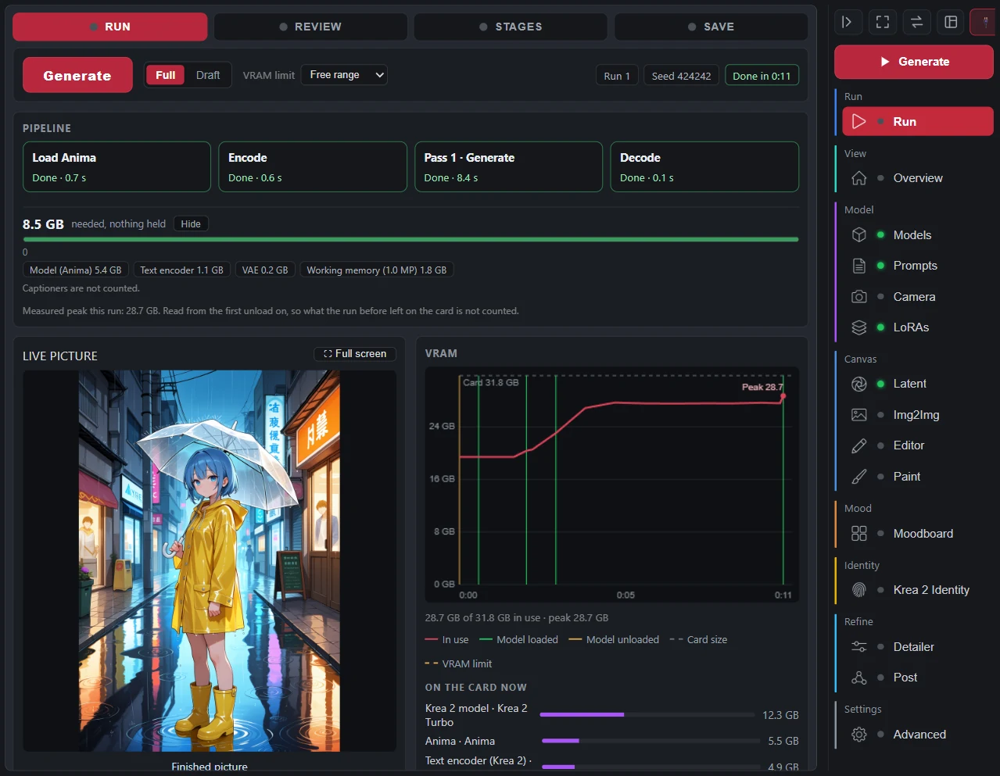

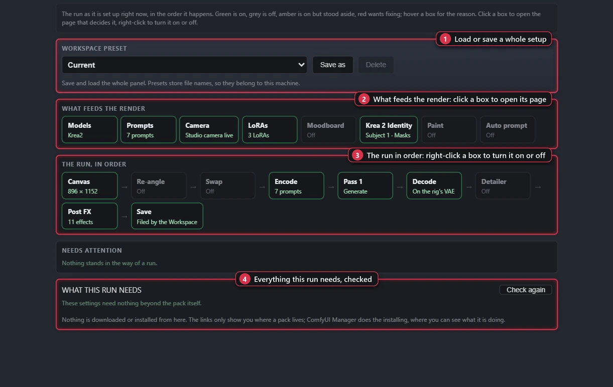

**Overview.** Workspace presets sit at the top: save the whole panel under a name and load it
back, with Current standing for the panel as it is now. Under that, the run as it is set up, one box per stage in the order it happens: what feeds the
render (the rig, the prompts, the camera, LoRAs, the Moodboard, the identity galleries, Paint, the
auto prompt), then the run itself (the canvas or source, Re-angle, Swap, the encode, every pass,
the decode, the Detailer, Post FX, Save). Green is on, grey is off, amber is on but stood aside
with the reason on hover, red wants fixing. A click on a box opens the page that decides it, a
right-click turns that stage on or off with the same switch its own page has, and a
Needs attention list under the map collects every reason a stage will not run, each line a link.
Under that, Check installs says which node packs, caption engines and model files these settings
actually call for, which of them are already here, and where to get the rest. It reads what
ComfyUI has loaded and the file lists it already hands the panel. It downloads and installs
nothing: ComfyUI Manager does the installing, where you can see what it is doing.

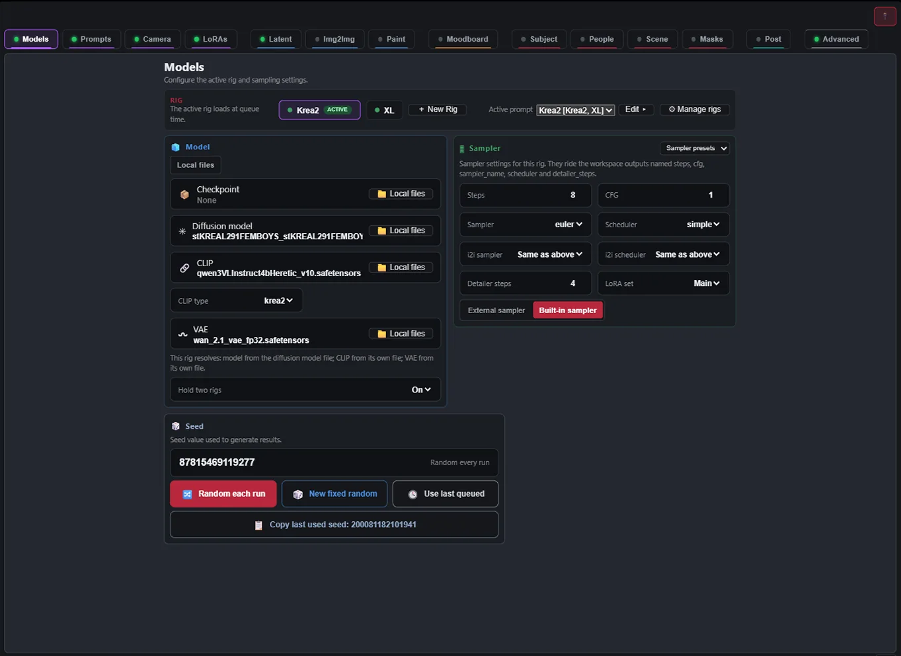

**Models.** A rig is a model with its CLIP and VAE, its sampler numbers, its detailer steps, a
second sampler pair for image to image runs, and which LoRA set it carries. Keep several and switch
the active one; a Detailer pass can name any of them, so a face can be detailed by a different
model from the one that rendered the frame. The same tab chooses between the built-in sampler and
an external one, holds the seed, and can keep two rigs in RAM at once so a two-rig chain stops
reloading. Each rig also folds away a set of sampler dials, all off by default: an AuraFlow shift
on the model, Detail Daemon (a sigma nudge over the run for finer detail without more steps),
Seed Variance (a jitter on the conditioning early in the run, so one seed lands on different
compositions) and densify the tail (extra steps only in the last part of the schedule). They ride
the built-in sampler and every Detailer pass on that rig, and so do three schedule shapes of the
pack's own on the scheduler list, beta57, bong_tangent and hyperbolic; a stock KSampler on the
scheduler socket is handed simple when a rig names one of those. A diffusion model file goes
through the loader the rig names: by file name, a .gguf through ComfyUI-GGUF and anything else
through the standard loader, or INT8 W8A8 outright through ComfyUI-INT8-Fast when that pack is
installed; the file picker lists those packs' files beside the standard ones. A rig can also be
your own nodes: name it on RedNode Rig Model, Rig Inputs and Rig Result, and every pass on that rig
samples through your graph, with no wire to the Workspace. A Krea 2 rig carries an Official Krea 2
model switch, and the identity edit warns until it is set.

The rigs sit in a column of cards on the left, each with its model family and a tick per file, and
the pages beside them are Model, CLIP, VAE, then Sampling, Seed and Setup. **Setup** makes a rig in
one click for Krea 2 Turbo, Z-Image Turbo, Qwen Image 2.1, Anima or SDXL / Illustrious / Pony: it finds the
files in your model folders by name, newest first, and sets that model's steps, cfg, sampler and
CLIP type, all of it editable afterwards. It reads file names and dates and nothing else, and
downloads nothing. The warning bar names the one next step a rig is missing, and **Match CLIP
type** sets the type from the text encoder file. **Sampling** is in cards: the main render, the
sampler node, image to image, the Detailer's steps and the dials. A rig can sample through another
pack's sampler node instead of the built-in one, starting with RES4LYF's ClownsharKSampler, and
falls back to the built-in one where that node cannot take the run. **Seed** holds the main seed,
named seeds of your own, and a link for each part of a run: Re-angle, Realism, Swap, Upscale, the
Detailer, the LoRA ranges, Post's random ranges and the auto prompt each follow the main seed, a
named one or their own, and Same seed every pass stops the passes stepping it.

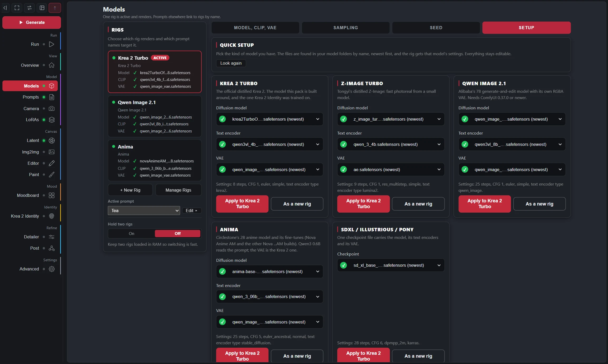

**Run.** Queue the workflow and watch it. The rail's Generate queues from any tab, and an
Advanced switch, off by default, makes it open this page as well. Generate here sits beside Full
or Draft (Draft makes the
Detailer and the Post chain pass the picture through for fast rerolls) and the VRAM limit, your
card's size from 8 GB to 32 GB+, or Free range. Under them the run's estimated peak, worked out
from the model files it will load, the size it works at and, for Swap and Re-angle, the edit
engine as a stage of its own. Hold is Auto, On or Off: Auto keeps the run under the limit only
when the estimate says it must, so a run that fits keeps its speed, and holding streams the
weights through the card instead of loading them whole. Below: a box per stage (captions, encode,
each pass, decode, Swap, Detailer, Post FX, Save) with its state, time and step count; the picture
forming, with a batch's frames as a strip under it; a VRAM chart with model loads and unloads
marked and the models on the card now; and a log of what is happening in plain words, every
Detailer pass and paint pass named with what it did. When nothing renders the log says why (no rig,
no VAE, External sampler with nothing wired to it), and External sampler always carries its own box
in the pipeline saying it renders nothing here, so a sampler mode left over from another graph is
never a silent empty run. A box or a line opens the page that decides it, the finished picture
opens full screen with the Review's menu, and a run with Save off still hands the panel its
finished picture, kept as a temp file, so the Live picture and the Review are never empty just
because nothing was written to disk. History under the log
reopens any run of the session. The Review sub-tab keeps every finished picture from this
Workspace like an Image Review node, the Stages sub-tab shows the last run's Stage Taps like a
Stage View node, and the Save sub-tab holds RedNode Save's settings: switched on, the Workspace
files every finished picture itself.

**Detailer.** The RedNode Studio Detailer's passes, run by the Workspace after the render and
before Post FX when switched on, so a single Workspace renders, details, grades and files. A
Detailer, Post Process or Save node already in an older workflow steps aside for any step the
Workspace did.

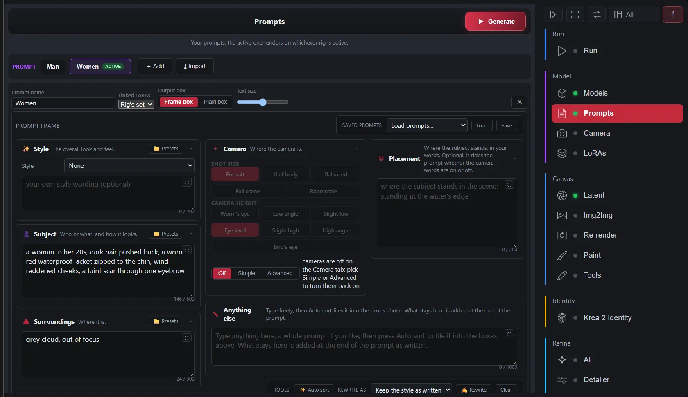

**Prompts.** Rows, and the one chosen on the Models tab renders on whichever rig is active. Each
row can name a LoRA set, which wins over the rig's own for that prompt. A row is either
a Frame box, the prompt frame editor with Style, Subject, Surroundings and Light and colour and the
framing dial between them, or a Plain box for any other model. Each writing box keeps its saved
versions behind a Presets button, and an Anything else box under the frame takes raw text: Auto
sort files it into the boxes, Rewrite rewrites the boxes in place. The frame's Camera section has a Camera words switch that stops every
camera sentence it writes, shot size, height stop and the studio's paragraph alike, and the Camera
tab's switch strips the studio's paragraph from the queued prompt as well as the LoRAs and the path. The auto prompt captions the references through a local vision model
(Ollama, WD14, JoyCaption, QwenVL or Florence-2, one Florence model and task shared by every tab),
with a length budget, a converter for gender and style swaps, and a saved prompts button.
Wildcards and `@keyword` macros resolve on the run's seed.

**Camera.** The stage from the camera section below, on its own tab, with a master switch. It has
two studios: the one behind the prompt, whose camera writes the paragraph and drives the camera
LoRAs, and a separate one for the Editor's Re-angle.

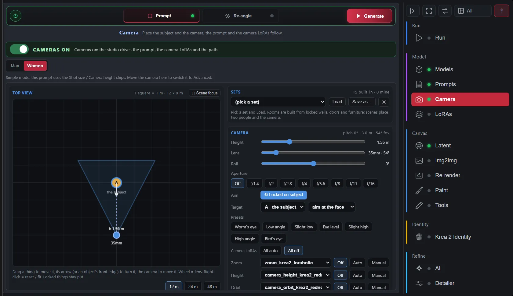

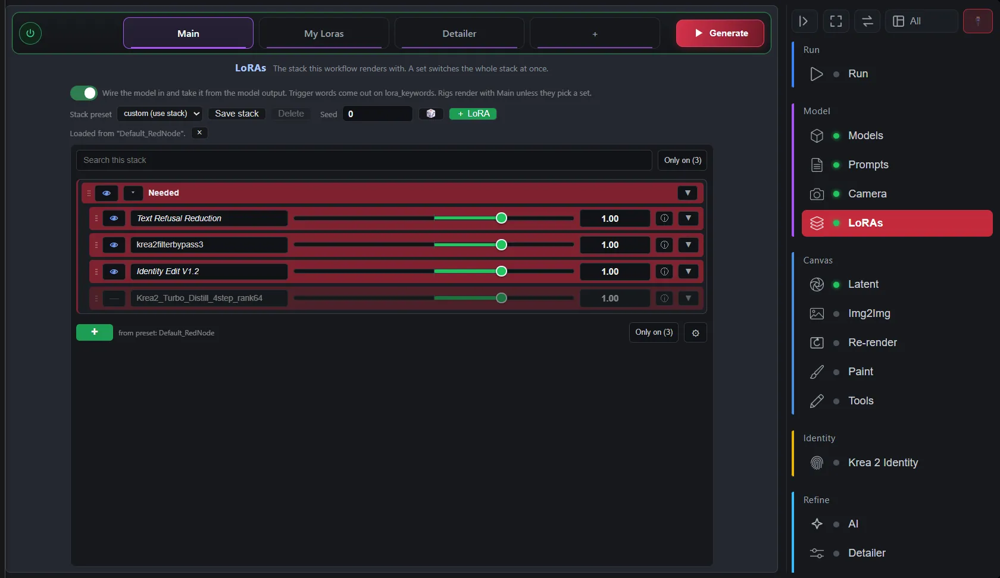

**LoRAs.** The main stack, plus named sets on their own sub-tabs. Rows drag by their grip, switch
off by their eye, and group under titles; a strength can be a random range with the roll shown
after the run. A rig picks its set by name, and so can a Detailer pass or a paint pass. The Paint
tab has a stack of its own. A search box at the top of the stack filters its rows by name and
stays pinned however long the stack gets, with an Only on switch beside it.

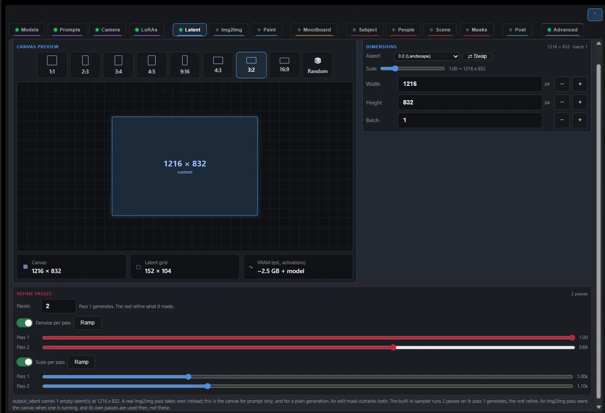

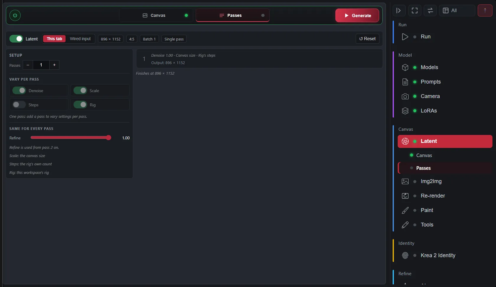

**Latent.** The canvas size, with aspect presets, a random size, and an auto latent that follows
the camera's frame at a pixel budget. Refine passes run on the blank canvas: pass 1 generates, and
every pass after it treats what pass 1 made as its source, at a Refine dial or a denoise and a
scale per pass with a Ramp, so a draft-small-then-climb run needs no second node. A rig and a step
count per pass are there too, which is how a HighNoise and LowNoise pair relays: pass 1 drafts on
one rig in a step or two, pass 2 finishes on the other at a denoise just under 1, with Hold two
rigs keeping both models loaded. Continue the noise between passes makes the passes segments of
one schedule instead, each carrying the last one's leftover noise on with none added, which is
how a Wan-style pair is meant to relay. The Img2Img tab's passes have the same sections.

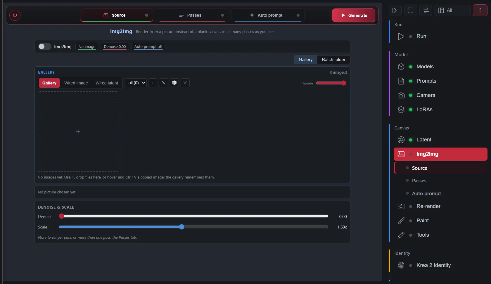

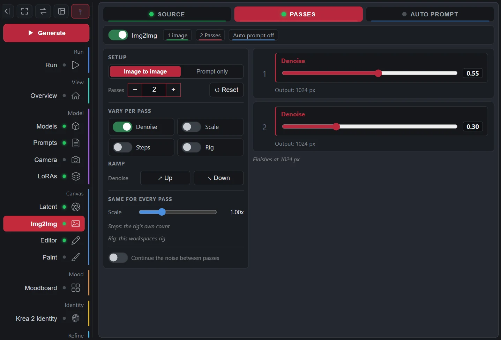

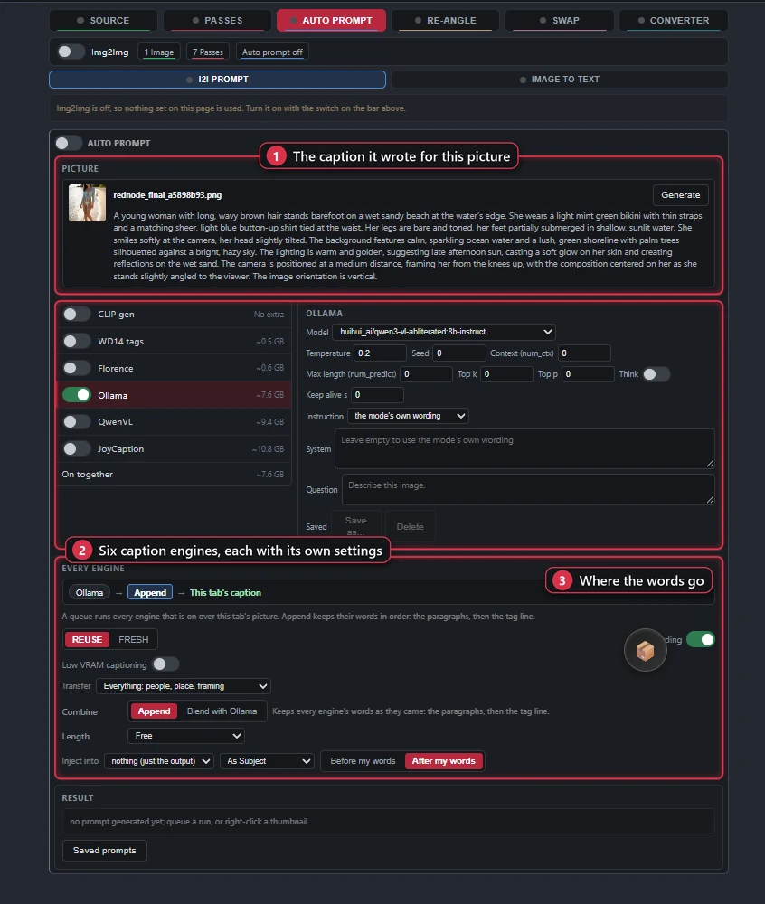

**Img2Img.** A source picture and the pass over it. At one pass, Denoise and Scale sit right
under the Source picture, so the common case needs no second tab. With several passes each one
can have its own denoise and its own scale on the Passes tab instead, and a folder of pictures can
run as a batch. Its Auto prompt page also holds IMAGE TO TEXT: Style,
Subject and Scene galleries whose pictures are only described in words, never sent to the model,
so a look, a person or a place can steer any rig's prompt.

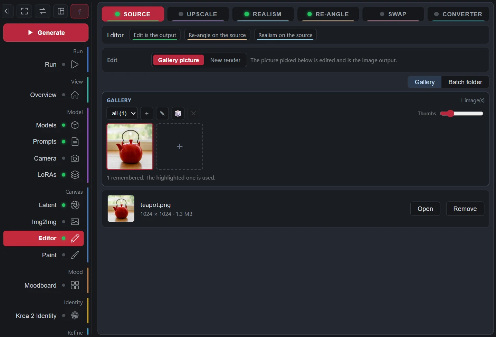

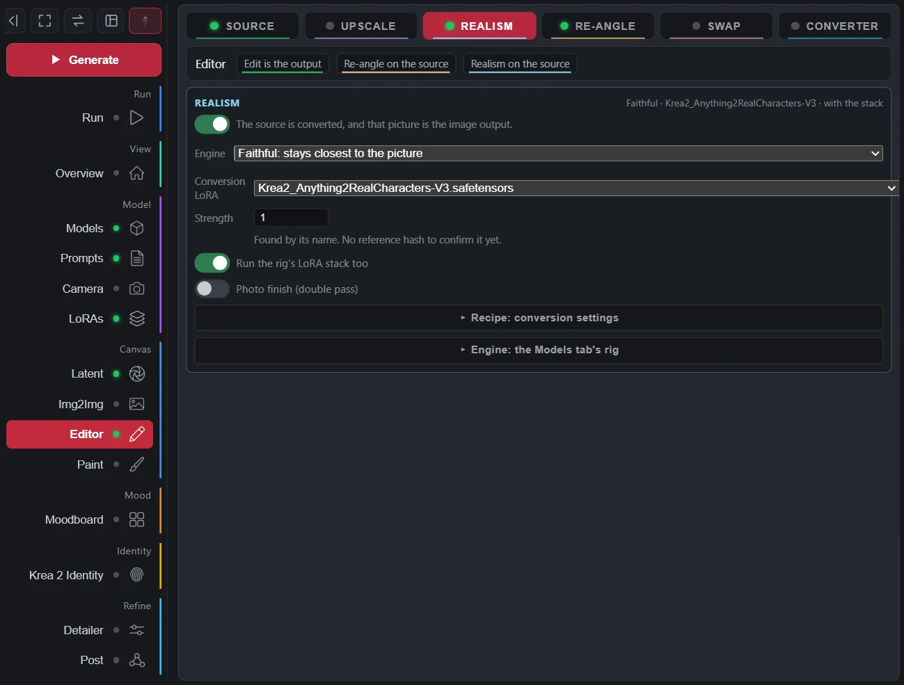

**Editor.** The edits, on a picture of their own, in six pages. **Source** holds the Editor's own
gallery and one choice for Re-angle, Realism and Swap together: edit the gallery picture, or render
first and edit the new render. The edited picture is the image output. **Upscale** runs one upscale
on one picture or a folder, SeedVR2, VOSR 2.0 or the tiled one, with a fit step first and a before
and after in the result, and it can take its picture from the Source gallery. **Realism** turns an
illustration into a photograph. Its Exact engine is the Anything2Real workflow node for node, with
an optional photo finish (a second, lighter pass) and a choice of the Ostris encoder; the
Alternative engine is the pack's own and needs no other pack. It finds the conversion LoRA among
your files by name and hash. A LoRAs-tab set can run underneath the conversion, and the **Set**
row says which one: left on (rig's set) it follows the Models tab, which is Main unless a rig
names another. The line under it says what will actually run, so the answer is on the page
rather than in the console after a queue. **Re-angle** re-shoots the picture from another viewpoint with the
multi-angle edit model, from three bands or from the Camera tab's studio. **Swap** puts a face, head
or whole person onto the picture: the Subject's, another picked person's, or a picture from Swap's
own gallery, with a Fast switch for the Lightning LoRA. They run in the order Re-angle, Realism,
Swap, so the medium is converted after the viewpoint is settled and before a face lands on it. On
the new render, a polish pass by the rig follows the edit. The edit models run on PyTorch
attention, so SageAttention does not break them, and each shows its steps on the Run tab.
**Converter** reworks the final prompt, with an optional rewrite by a local Ollama model.

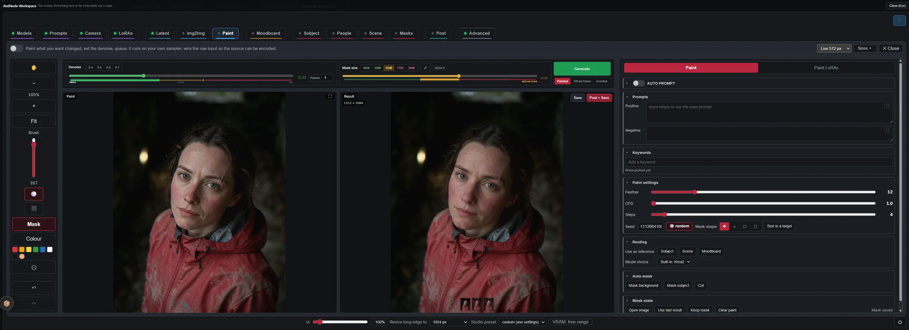

**Paint.** Mask a region, set the denoise, queue. It composites back by itself, and it runs on
whichever renderer you point it at: a rig from the Models tab, the pack's own Paint Render, or an
outside chain through Paint Out and Paint In. Auto-mask the subject or the background rather than
painting by hand, paint in colour to steer the fill, and run the low-denoise chain as passes in
one Generate. While it samples, the picture forms over the result pane, step by step, at a frame
size the tab chooses. Every result stays in a history with a full screen viewer of its own, and
one click sends the keeper through the post chain and into the save tree. Blend sits beside
Feather, the Detailer's dial for how much of the repaint goes back under the mask. Use last result
can take the picture from before Post FX, so grain and grade never land under the brush, and the
Subject, Scene and Moodboard reference toggles follow the Model choice's rig. Blank canvas makes
a white sheet at the Latent tab's size to paint on from nothing, grey or black on a right-click,
and Clear canvas takes the picture off as well as the paint, where Clear paint keeps it.

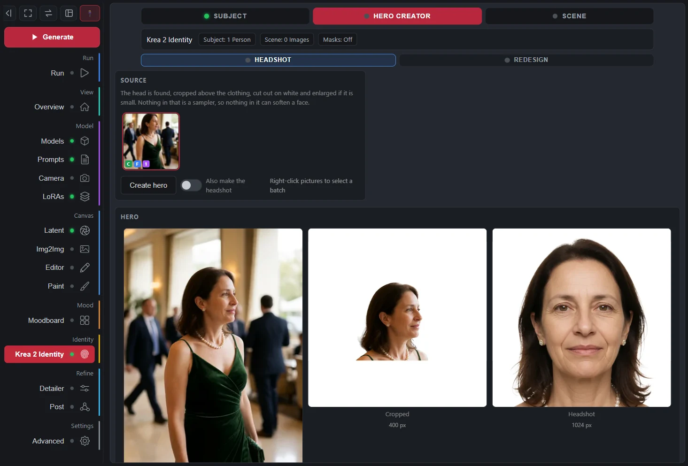

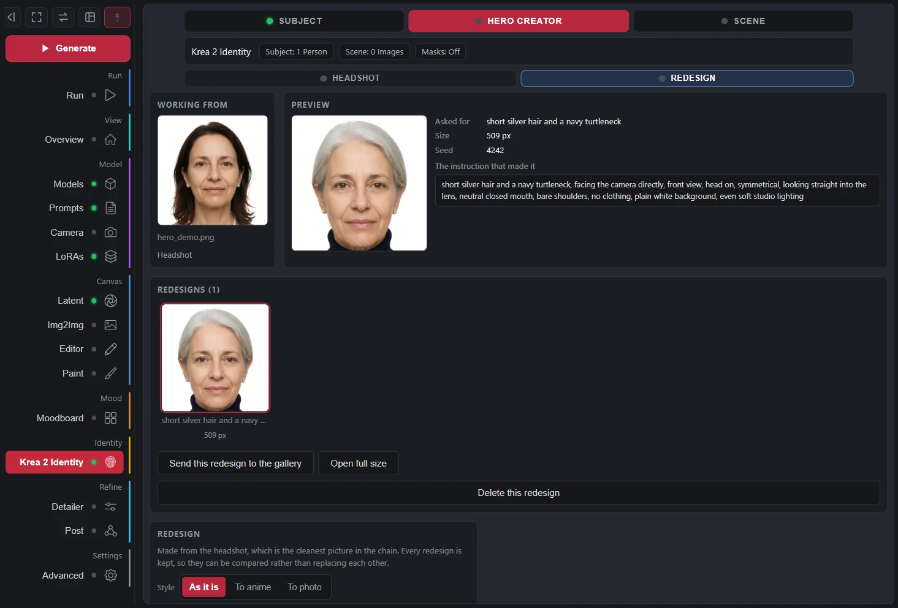

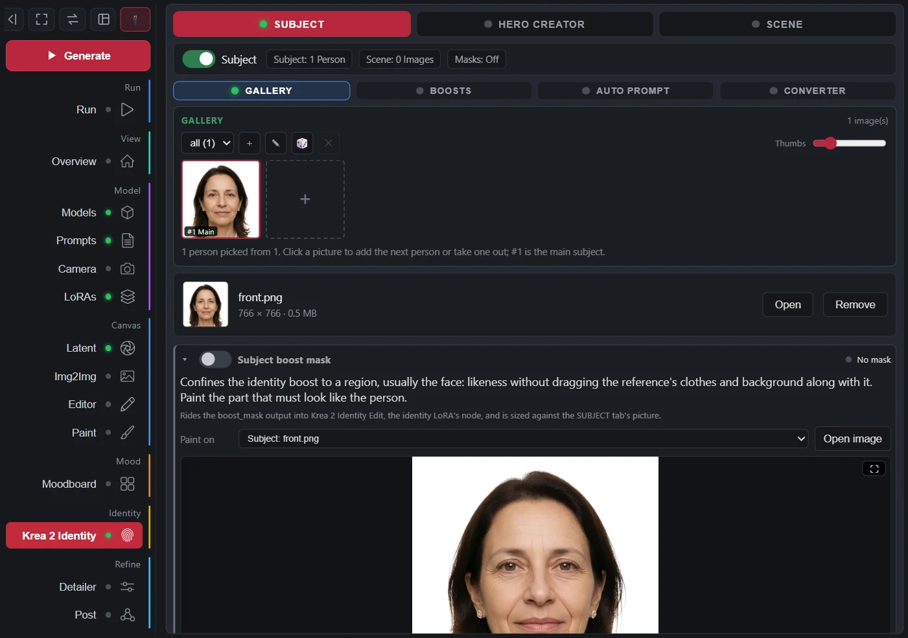

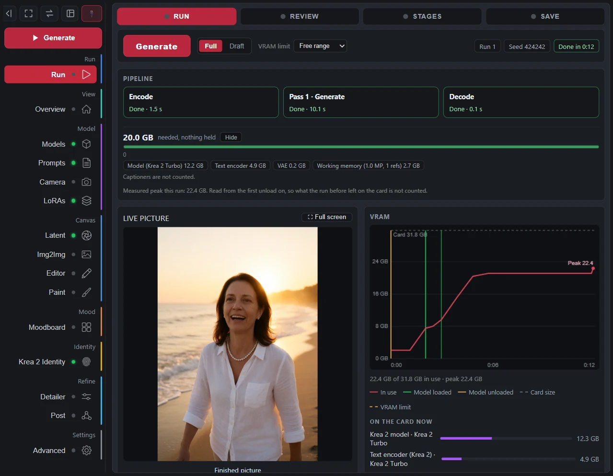

**Krea 2 Identity: Subject, Hero Creator, Scene, Masks.** One tab with a sub-tab for each, and a
light on each showing what is in use. The Hero Creator makes a clean front-on headshot out of a
gallery picture, crops the clothing out of frame, and can redesign it with a render; the result
goes back to the gallery as a subject reference. Subject is one gallery where you pick the people in order: the
first is the main subject, and the others follow as Person 2, 3 and on (more than three still
runs, with a warning that faces may blend). Scene is a place rebuilt as in-context latents.
Subject and Scene each have Gallery, Boosts, Auto prompt and Converter tabs; the Subject boosts
apply to every person. Scene has a window, from and until, and a Words only switch that captions
the picture without sending it as a reference; Boosts off keeps a fidelity set below 1. Masks holds the subject boost mask, which rides into the identity edit
and is sized against the main subject's picture. To change part of a picture in place, use
the Paint tab.

**Moodboard.** Batches several pictures into one style signal. Gallery, Boosts and Auto prompt
tabs sit under a status bar, and Boosts has one-click presets from A hint to Outfit transfer. Its
Auto prompt reads every picture as Style, Subject or Situation and injects the words into that
slot of the prompt frame. Right-click a picture in any
gallery for the gallery menu.

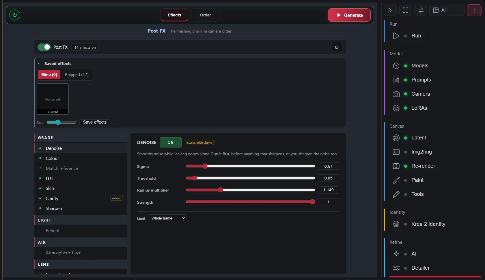

**Post.** The grading chain, twenty effects in physical camera order, with random ranges on any
dial. The tab is a list of the chain on the left, an eye per effect to switch it on, and the
selected effect's controls on the right, one at a time; the Order view lays the effects that are on
out as numbered cards to drag into another order, double or take out. Every card has a Limit row:
whole frame, subject only or background only, through the pack's own auto-mask, with the Mask card
setting the source and the feather. RedNode Post Process finds these settings by itself when it
sits at the end of the graph.

The cards cover the whole grade. Colour is exposure in stops, shadows and highlights that keep
black black and white white, local HDR, lift, gamma and gain, vibrance that leaves skin alone, and
split tone, with a Measure button that reads the frame's white balance and writes it into the
dials. Skin retouches skin and nothing else: a mask built from colour that stays off eyes, lips,
teeth and busy fabric, then de-yellow, rosy, evenness, and smoothing with a texture dial that keeps
the pores. Sharpen has a Detail band mode for AI frames that bites without halos, speckled skin or
white rims on hair. Film stock turns light into density the way twelve stocks do, colour negative,
slide, tungsten cinema, instant and black and white with its lens filters. Lens distortion carries
a lens picker, from a 14 mm ultra wide to a 135 mm, phone, vintage and anamorphic glass, that fills
the distortion and fringing dials at a size that holds at any resolution. Depth of field, haze and
Relight, a new key light over the picture's relief with contact shadows, make their own depth map;
the Depth card picks the estimator, the checkpoint and the resolution. Match reference moves the
frame's colour onto a dropped picture or a Moodboard, Subject, Scene or Img2Img picture with skin
held back, and LUT applies a .cube file from models/luts.

Saved effects has two tabs. Mine keeps the effects you save, every dial and the order, with a
picture of what they did. Shipped is a library of seventeen looks that come with the pack, each
with a picture: Camera Ready starting points for Krea 2 and Z-Image, portrait, beauty and product
advertising grades, food, cinematic and night looks, a faded 70s print, 90s instant film,
disposable flash, an early digital compact and black and white. Apply one freely; save a copy under
your own name to change it, since the shipped ones cannot be edited or deleted.

**AI.** Pictures to words, on a page of its own so captioning never means switching Img2Img on
and walking through its pages. It has its own gallery, saved with the workflow: drop pictures on
it, drag them in from the Shelf or from any result, and pick one. **Picture** captions the one you
picked with the same engines the rest of the pack uses, and the words are yours to copy or send
on. **Batch** captions every picture on the page in turn and writes each caption beside its own
picture as `picture.txt`, which is the layout a LoRA trainer expects, so a folder of pictures
becomes a folder ready to train from. It runs one at a time, says which picture it is on, and
stops when you press Stop. Nothing on this tab reaches a render: the Img2Img tab keeps its own
Auto prompt for that.

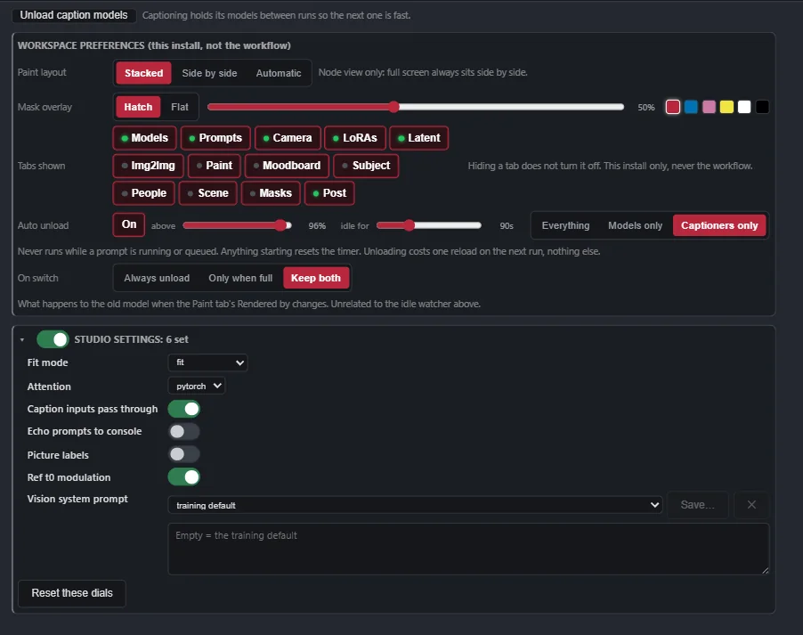

**Advanced.** The workspace's preferences for this install rather than this workflow: the page
size and the rail's own size, which tabs the rail shows and your saved UI presets, whether the
rail's Generate opens the Run page, the paint layout, the mask overlay, whether prompts echo to the
console, and a button to unload the caption models.

## The Detailer

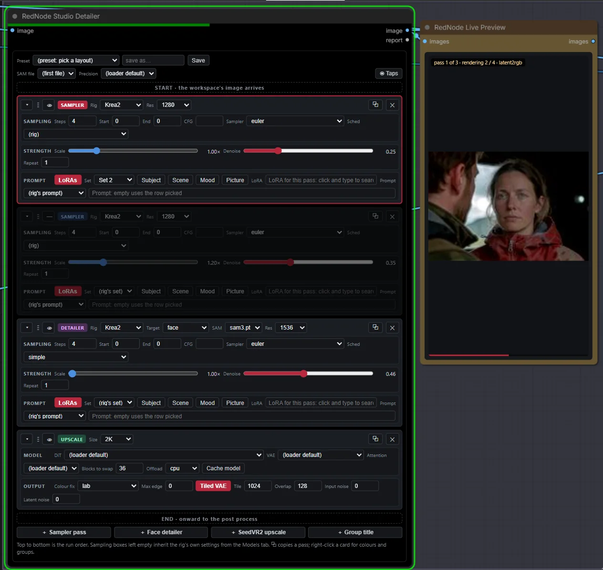

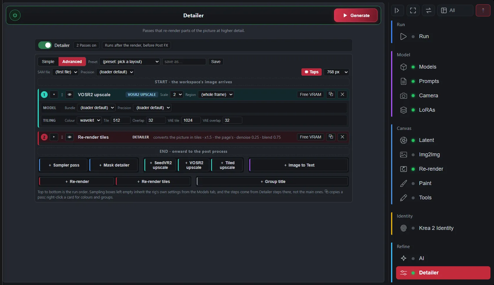

RedNode Studio Detailer is the post-render work as a list, read top to bottom, with no wires
between the passes. It has two views of the same passes. Simple shows what most passes need: the
rig, the target, the size, the strength bars and the references. Advanced shows every setting.
Switching views changes no value, and in Simple a card carries a chip naming any hidden setting
that is in use. Every pass has a name in front of its kind: left alone it names itself (Tiled
upscale, Face detailer 2), and a name you type is kept and used in the run log. Each pass is a
card: what it is, which rig runs it, what it aims at, and three
boxes under that. Sampling holds steps, CFG, sampler, scheduler and a start and end step window,
where anything left empty inherits the rig's own numbers. Strength holds Scale and Denoise as bars
and the Repeat count, and a repeat above one offers a denoise and a scale per round with a Ramp.
Prompt holds the LoRA stack switch and its set, the four Krea 2 references, a LoRA for this pass
only, which Prompts-tab row it reads, and a box that wins over all of that when it has words.

The kinds of pass:

- **Sampler**: the whole frame refined at a denoise, an image to image over what arrived. Its
  scale sticks, so 0.5 then 2.0 across two passes is the shrink-and-regrow chain.
- **Detailer**: SAM3 segments a target, face, hair, hands, eyes, clothes or background, the crop
  renders at a working resolution, and goes back under a feathered mask at a blend, so a stronger
  denoise can be softened at the paste instead of at the sampler. The SAM file and its precision
  are picked once on the node.
- **Upscale**: SeedVR2 at a size, 720p, 1080p, 2K, 1440p or 4K as a pixel budget, with the short
  edge worked out from the frame's own aspect. The loader dials sit on the card. A region, face
  or hair, upscales that crop only and the frame keeps its size; an out-of-memory halves the
  tile and tries again.
- **Tiled upscale**: Ultimate SD Upscale as a pass, the rig's model and the pass's prompt over
  tiles, an upscale model first or a plain resize, opened on 6 steps of deis at 0.25 denoise,
  1024 tiles padded 128 and no seam fix. Needs ComfyUI_UltimateSDUpscale.
- **Realism**: the Editor's conversion as a pass, so an illustration can become a photograph in
  the middle of a chain and the passes after it work on the photograph. The recipe is the Editor's
  Realism page, so there is one place to tune the sizes, the encoder and the sampler; the card
  carries what is worth changing per pass: the engine, the photo finish, the conversion LoRA and
  its strength, which LoRA set runs under it, and the words it is asked for. It has a **Denoise**
  bar, which the page does not: at 1.00 it converts as the page does, and below that the picture
  is the starting point and only part of it is rewritten, so the original's own texture survives.
  **Blend** mixes the converted picture back over the one it came from, which takes a conversion
  part of the way for no extra render. No scale: the frame comes back the size it arrived.
- **On every card**: Free VRAM before the pass, and Tone lock, which keeps the pass's new detail
  but takes the tone from the picture as it arrived, the drift fix for a long chain.

Duplicate a pass with the button beside its delete and nudge one number, which is how a chain
gets built. Group titles fold and switch a set of passes at once. Premade layouts ship, the face
identity chain among them, and your own save by name. Taps record the input, every pass and the
output into a Stage View strip, so a chain can be read step by step. A batch goes through every
pass one picture at a time, SeedVR2 included, and the Run tab's log names each pass with what it
did.

**Image to Text.** A pass that renders nothing. It reads the picture as it stands at its place
in the chain and hands those words to the passes after it, so a long chain can describe what
it actually has rather than what the run started from. **Picture** says which one it reads: the one arriving at this pass, after everything above it has run, which is the usual choice, or the picture picked on the AI tab when a chain should describe a reference instead. It reads with the AI tab's engines,
so there is one place to pick them and one place to see what they cost, and the box on its
card is combined with what it read: your words lead by default, and a switch puts the
reading first.

Every pass after it takes those words when its own prompt box is empty, and a pass can also
choose in its **Prompt** picker: a Prompts-tab row as before, **The last Image to Text**, or a
particular reader by name when the chain has more than one. Nothing about this reaches what
is saved: the metadata still carries the prompt the run was asked for.

To read what it wrote, watch **What's happening** on the Run tab. The pass puts a
**Prompt completed** line there, and clicking that line opens the whole prompt in a box you
can select from, with **Copy**. The line belongs to the run, so opening an older run from the
column down the left brings its prompts back with it.

## Watching a render

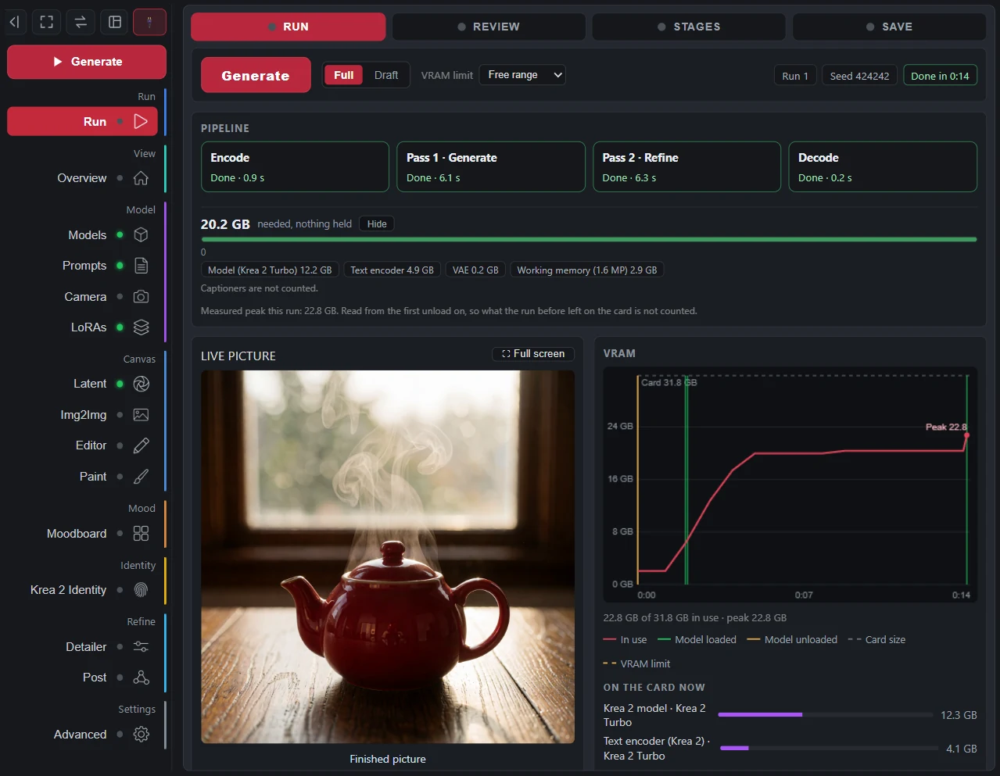

The **Run** tab is where a render is watched. Generate sits at the top with the Draft switch and
the VRAM limit; under it the pipeline names every stage with the time it took, then the estimate
card says what the run needs against your card, and the live picture and the VRAM chart sit side
by side while the log reads the run out step by step. What is on the card right now is listed
under the chart, largest first.

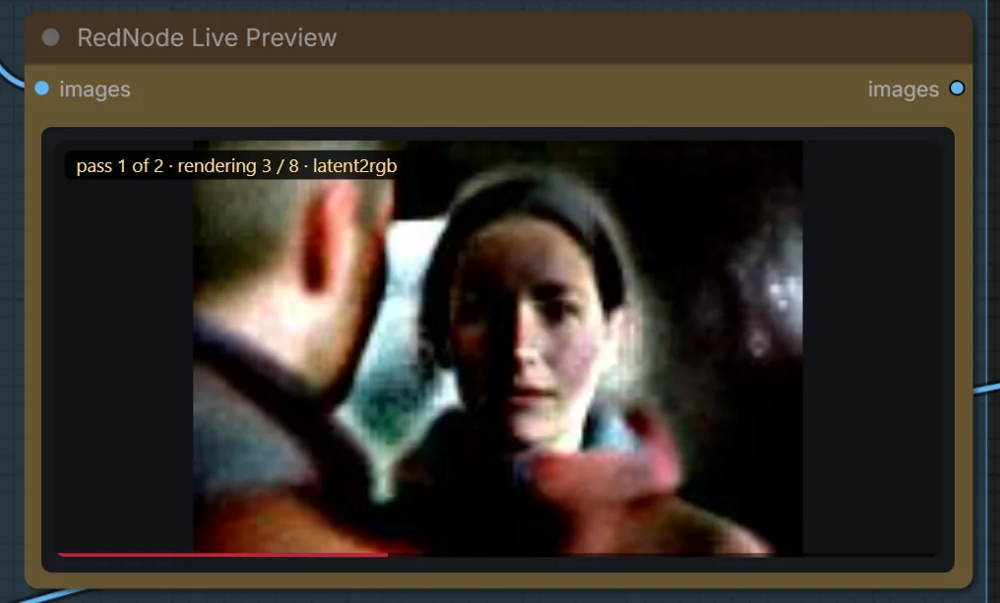

**RedNode Live Preview** shows the picture forming. Wire an image output into it and every step of
that node's render lands on it, decoded by the small VAE, with a bar and the pass it belongs to,
then the finished frame, kept at 512 px since it is a preview; the output passes the full picture
on. Both the workspace's built-in sampler and the Detailer's passes stream,
whatever ComfyUI's own preview setting is. For Krea 2 the sharp version needs
`lighttaew2_1.safetensors` in `models/vae_approx`; without it the frames are the colour smear.

**RedNode Image Review** is a preview that remembers: the newest picture on top and the runs before
it in a strip, right-click for Copy, Keep, Name and Rerun with the same seed or fresh ones. Double
click the picture for a full screen room where the wheel zooms and a drag pans. A run that made
several pictures, a camera path or a batch, shows them in a column beside the big one. Left and
right arrows walk the history, up and down walk the frames of that column.

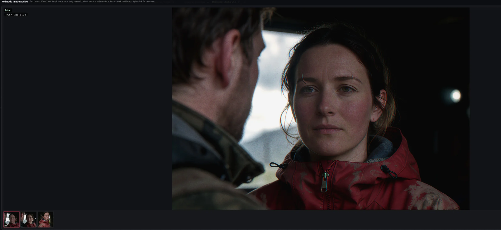

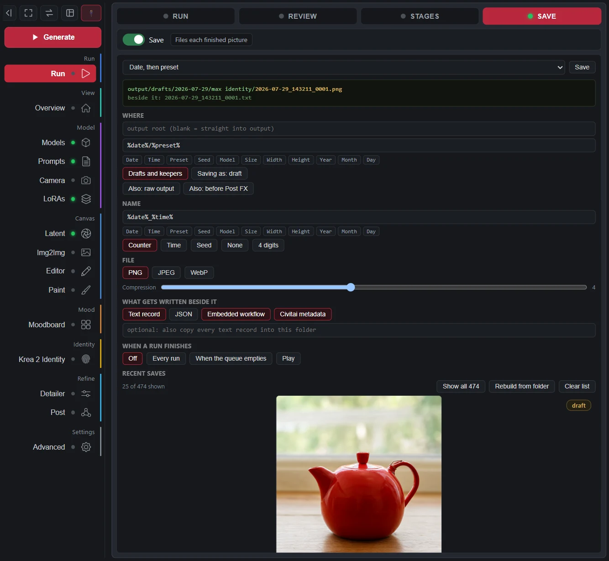

**RedNode Save** files by date, preset, seed, model or size, splits drafts from keepers, and keeps
a browser to cull a session without leaving the graph. The Review and the Save node share the
run's id, so keeping the picture you are looking at needs no wire. Every file also carries the
A1111 parameters text with the model and LoRA hashes, so a picture posted to Civitai lists what
made it, with links; each model file is hashed once and the digest kept in a `.sha256` beside it.
The Civitai metadata switch on the panel turns that off. A finish sound sits on the same panel,
off by default: every run, or once when the queue empties, so a batch sounds once at the end.

**RedNode Stage Tap and Stage View** photograph any point in the graph and compare two of them with
a wipe. The Detailer's Taps feed the same strip. A Full screen button, or a double-click on the
picture, puts the strip and the wipe over the whole window. Each tap keeps its frame at a size you
pick on the node, 320 px up to full size, and the view scales it to fill whatever room it has.

## Keeping the canvas small

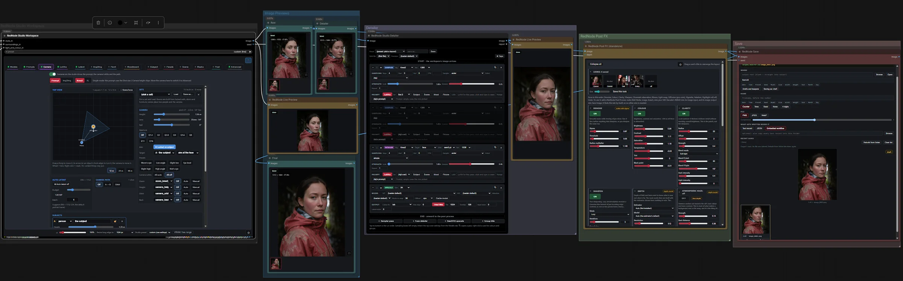

Stages live in subgraphs and groups, so the canvas stays this small however much is in it. Group
Control switches groups on and off from one panel, Group Modes names whole configurations, and
branches you did not pick never execute.

Control Panel drives other nodes' dropdowns, sliders and toggles from one node, including nodes
inside subgraphs. Palette and Router route the graph by colour. Sender and Grabber replace a
canvas of Get and Set nodes with named channels. The wires that are not there are the point.

**Copy and paste on the Shelf.** Point at a picture on the shelf and **Ctrl+C** puts it on the system clipboard, full size, ready for any other app. **Ctrl+V** with the pointer over the shelf takes whatever picture is on the clipboard, a screenshot included, and puts it on top. **Delete** takes the one you are pointing at off the shelf, and the file itself is left alone: the shelf holds names, not copies. The shelf your pointer is over is the one the keys drive, a prompt box you are typing in keeps its own copy and paste, and an empty shelf passes Delete on to ComfyUI so the node can still be removed.

**The Shelf as the picture.** A RedNode Shelf beside the Workspace has an **Override** switch.
With it on, the picture picked on the shelf is what the ticked tabs render from, in place of
whatever their galleries hold: tick **Img2Img** and every run works on the shelf's picture,
without touching a gallery. The chips choose where it lands (Img2Img, Editor, Subject, Scene,
Moodboard), and a ticked tab is switched on for the run, the same as sending a picture to it by
right-click. Nothing is written into the Workspace, so switching Override off hands every tab its
own picture back, exactly as it was. Drop a new picture on the shelf and the next run uses that
one. Only one shelf can hold the override: turning it on somewhere turns it off everywhere else,
and if a workflow arrives with two of them on, the one switched on last speaks and the run says
so.

## The camera stage

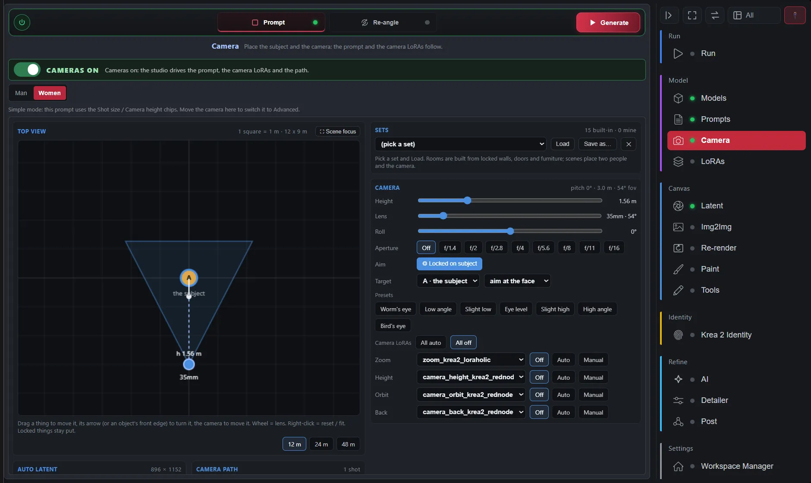

RedNode Camera Studio is a stage seen from above. Put the subjects on it, drag the walls out to the
size of the room, then move the camera. Every subject card carries a lock, a duplicate button and a
remove button; a duplicate lands at the end of the list beside its original, unlocked, ready to drag
into place. What comes out of it is not "wide shot": it is the physical
camera language the model already answers to, a lens length, a height, a distance and an angle,
worked out from where you actually put things. The tab has its own switch like the others, so the
whole camera leaves the prompt in one click when you want the words to do the framing instead.

Fifteen setups ship with it, and a set carries the whole stage at once: camera, subjects, room size,
path and lights. Load one and adjust, rather than building a room from nothing every time. A camera
path renders one image per shot, so an orbit from -60 to +60 is a single queue and one scene from
six viewpoints. That holds on the built-in sampler and on an engine rig; an external sampler gets
one conditioning, and the tab says so when a path meets one.

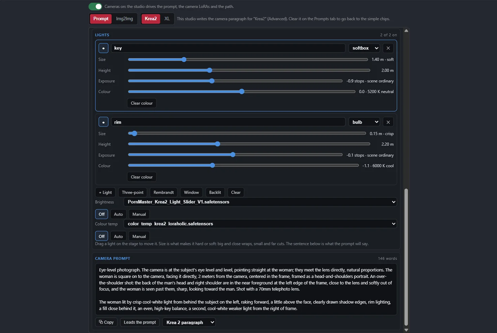

Lights sit on the same stage, each with a size and a distance, and both of those do work.
Illuminance falls off with the square of the distance, and how hard a shadow reads is really the
light's angular size from where the subject is standing, so a wide source close in and a small one
across the room come out as different words. Those words describe light and never fixtures: name a
lamp in a prompt and you get a lamp in the picture, so the wording stays on what the light is doing
to the scene. Exposure runs in stops either side of a centred zero, darker one way and brighter the
other, and colour runs in mireds either side of neutral daylight, warm one way and cool the other.

The stage turns that same geometry into slider strengths. Four camera sliders, zoom, height, orbit
and back, each one off, auto or manual. On auto the slider follows the stage, so pushing the camera
in moves zoom with it and there is no second number to keep in sync. The two lighting sliders work
the same way off the exposure and colour dials. Every slot is empty until you pick a file, and the
stage is happy with none of them.

In a plain graph, without the Workspace, wire a model and clip into RedNode Camera Studio and take
them out again: they come out with the sliders applied at the strengths the panel shows, and the
prompt output leads your text. That is the whole classic setup: the Studio, a text encode and a
sampler. On a camera path the model comes out once per shot, each at that shot's strengths. RedNode
Camera LoRAs does the same job as a separate node for graphs that want the slider files and modes
chosen there, or that get their camera_json from elsewhere.

Three of the sliders are mine, trained for Krea 2, and they are attached to the
[v1.2.0 release](https://github.com/RedNodeAI/ComfyUI-RedNodeStudio/releases/tag/v1.2.0) and listed
[on Civitai](https://civitai.com/models/2937168) with example strips:
`camera_height_krea2_rednode`, `camera_orbit_krea2_rednode` and `camera_back_krea2_rednode`. Free to
use and share, just not to sell. The zoom slider and the colour temperature slider are Loraholic's,
on Civitai: [zoom](https://civitai.com/models/2717832) and
[colour temperature](https://civitai.com/models/2760910). The brightness slider is PornMaster Krea2
Light Slider, also on Civitai. They all go in `models/loras`.

## The prompt frame

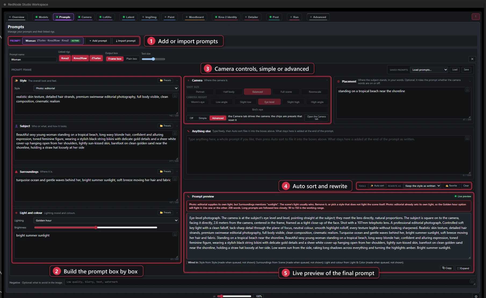

Word order sets the framing. Open a prompt with the person and you get a close shot. Put the room
first and the camera pulls back, same words. That is most of what "wide" and "close" actually mean
to the model, and it is the first thing to go once a prompt is long enough to be useful.

RedNode Prompt Frame splits the writing into Subject and Surroundings and puts a framing dial
between them. Portrait, Half body, Balanced, Full scene, Roomscale. The two tight steps lead with
the subject and open it with "A close view of" or "A three-quarter view of". Balanced and wider lead
with the surroundings and set the subject inside them, then add a scale cue at the two widest steps,
"seen full length" and "small in the distance". Your wording is never rewritten. Only the order and
the joining words change.

At Full scene and Roomscale a subject with nowhere to stand can drop out of the picture entirely.
Two dropdowns build a placement, "beside the doorway", or type your own and it overrides both.

Style blocks, twenty lighting setups and a brightness ramp slot in around that text at fixed
positions. The second output is a notice line, and it does real work: it says when the style already
lights its own scene and the lighting dropdown will fight it, when a wide framing has no placement,
when the prompt has run past the 90 to 150 word working range, and when Portrait framing carries
surroundings long enough to pull the camera back on their own. Wildcards and @keywords resolve in
the finished text, seeded, the same as the Prompt Box.

The panel builds its preview by asking the node, so what it shows on the canvas is what renders.
The same editor is what a Krea 2 prompt row on the Workspace's Prompts tab is. Each section,
Style, Subject, Surroundings and Light and colour, saves and loads its own named snippets, and
the camera segment reads Off, Simple or Advanced: Off writes no camera sentence at all.

RedNode Describe To Boxes fills those boxes from a picture. It sends the image to a local Ollama
vision model, asks for five labelled sections, and hands back Subject, Surroundings and Light and
colour on separate outputs, with the raw reply on a fourth in case the split came back malformed.
Its engine choice adds Florence + Ollama: Florence-2 writes the caption and Ollama, text only, sorts
it into the sections. The vision model is released from VRAM as soon as the reply lands, so it does
not sit on top of your checkpoint for the rest of the queue. Beside the Frame's Auto sort button a
Rewrite button sends the boxes through the same Ollama model as a writer, with a style tag
(keep, photoreal, cinematic, illustration), and puts the result back in the boxes for editing.

## The Krea 2 system

The workspace works with any model. This section is about the part that only applies to Krea 2.

Stock ComfyUI runs Krea 2 text-to-image perfectly well. These nodes exist for what the stock nodes
cannot do with reference images.

Stock image-reference encodes (the qwen-edit style nodes) pass references through the encoder as
semantic description only, using QwenImage's template rather than Krea 2's. The model learns what
is in your reference, with no control over which aspect transfers, no strength dial, and
multi-reference inputs that can collapse into grid or collage outputs. Core's `ReferenceLatent`
attaches latents that Krea 2's stock model ignores, because there is no in-context pixel path, so
no true identity preservation and no edit-LoRA support.

This pack adds both halves on top of the stock implementation: the moodboard controls (strength,
style against subject extraction, crops, indirect mode, grid-safe packed spans) and the full
identity-edit recipe (in-context source latents at RoPE frames 1 to N, Krea 2 template grounded
instruction and grounded negative, v1.2 fit geometry, ref_boost). Every patch is additive. Leave
the nodes unused and each patched path is bit-identical to stock ComfyUI.

To use it you need:

- ComfyUI with native Krea 2 support
- The **qwen3vl_4b** text encoder with vision weights, loaded through CLIPLoader with type `krea2`
- `qwen_image_vae`
- For editing, a krea2_edit LoRA at strength 1.0 through LoraLoaderModelOnly

The Workspace folds the studio in: a Krea 2 rig encodes through the identity system with the tab
images loaded, so the references never need a wire. **RedNode Studio (Krea 2)** is the same encode
as a node of its own, for a classic graph: it replaces the positive `CLIPTextEncode`, takes the
references on sockets, and outputs a matched positive and negative pair.

Companion to the [Forge Neo version](https://github.com/RedNodeAI/forge-neo-krea2-toolkit), same
algorithms and same knobs.

## The nodes

### Studio and workspace

| Node | What it does |
|---|---|
| RedNode Studio Workspace | The whole input rig in one tabbed panel, wired to the studio by a single bundle. The Latent tab runs refine passes on a blank canvas, the Img2Img tab's RE-ANGLE can stop after the re-shot so the rig stays out of VRAM, a rig can name a second sampler pair for image to image runs, and a camera path renders one image per shot on the built-in sampler and on an engine rig. |
| RedNode Studio Detailer | The post-render passes as a visual list: sampler refines and SAM3 face detailers in order, each with its own rig, steps, CFG, sampler, step window and scale ratio, no wires between them. A pass can repeat with a denoise and a scale per round, pick which Prompts-tab row it reads, and a SeedVR2 upscale pass (720p to 4K) sits in the same list; the SAM file and precision are picked on the node. |
| RedNode Studio (Krea 2) | Moodboard and identity edit in one node, with a matched grounded negative. The studio the Workspace folds in, for a classic graph. |
| RedNode Studio Settings (Advanced) | Every dial in plain language, for when a preset is not enough. |

RedNode Studio Preset Save and Preset Load still ship and still work, but the Workspace covers
what they did. Treat them as legacy.

### Routing and control

| Node | What it does |
|---|---|
| RedNode Palette | The colours that drive every Router. Switch a colour, re-route the graph. |
| RedNode Router (advanced switch) | Each branch passes when its colours are on. Losing branches never run. |
| RedNode Router Control | Counts every Router and turns their unique colour combinations into one non-stacking switchboard. |
| RedNode Switch | Pass one of several inputs through, chosen by name. |
| RedNode Pass (colour trigger) | Passes anything through and flips Palette colours as it goes. |
| RedNode Free VRAM | Unloads models at this exact point in the chain, so a second big model can run on a card that cannot hold both. |
| RedNode Control Panel | Many other nodes' dropdowns and toggles on one node, no wires. |
| RedNode Combo Control | The single-row version of the same idea. |
| RedNode Group Control | Turn workflow groups on and off, with saved scenes. |
| RedNode Group Modes | Named modes that enable one set of groups and bypass the rest. |
| RedNode Rig Out / Rig In | Hand a Models-tab rig's prompt, seed and sampler numbers to an outside engine, then bring its picture back into the chain. |

### Camera

| Node | What it does |
|---|---|
| RedNode Camera Studio | A top-view stage: place the subjects, the walls and the lights, move the camera, and the geometry is written as the physical-camera language Krea 2 obeys. Wire a model and clip through it and they come out with the slider LoRAs applied. Camera paths render one image per shot. |
| RedNode Camera LoRAs | Applies the camera slider LoRAs (zoom, height, orbit, back) from the studio's own geometry, off / auto / manual per slider. |
| RedNode Camera Multi-Angle | Turns the studio's camera into a Qwen-Image-Edit Multiple-Angles prompt, for re-shooting an existing photo from another viewpoint. |

### Images, painting and review

| Node | What it does |
|---|---|
| RedNode Save | Files images by date, preset and seed, and splits drafts from keepers. |
| RedNode Paint Render | Renders only the region you painted, then composites it back. |
| RedNode Paint Out / Paint In | Hand the painted region to any other renderer, then composite the result back. |
| RedNode Refine Crop / Refine Paste | Cut a masked region out for refinement by any sampler, then put it back. |
| RedNode Shelf | A place to put pictures while you move them around. Drop them on, drag them off onto any gallery, the Paint pane, another shelf or a folder on your desktop, and right-click one to send it straight to a Workspace tab. Dragging out copies, so nothing leaves the shelf until you take it off. The picture picked on it also comes out of the image socket, which makes it a Load Image you can drag out of. Its Override switch makes the picked picture the one the Workspace renders from, on the tabs you tick, for as long as it is on. |
| RedNode Image Review | A preview that remembers, with a browsable strip of previous runs. Double-click the picture for a full screen view where the wheel zooms and a drag pans. A run that made several pictures shows them in a column beside the big one; click to view any of them. |
| RedNode Live Preview | Shows the picture forming step by step while the node wired into it renders, then the finished frame. The workspace and the Detailer decode every step with the small VAE (lighttaew2_1 in models/vae_approx for Krea 2) and stream it here, whatever ComfyUI's own preview setting is. |
| RedNode Rig Model | Your own loaders as a Workspace rig. Wire in a model, CLIP and VAE; out come the same with the Workspace's LoRAs for that rig applied, ready for your sampler. Give it the rig's name, and pick Your own nodes for that rig on the Models tab. Nothing is wired to the Workspace. |
| RedNode Rig Inputs | What the Workspace hands your sampler for the rig named on it: positive, negative, latent, seed, steps, CFG, sampler, scheduler, denoise, start step and end step. The prompts carry the cameras, and on a Krea 2 rig the Subject (every person picked) and Scene references. |
| RedNode Rig Result | The end of your rig: wire in the finished latent or picture. The main render, every Latent and Img2Img pass, the paint pass and every Detailer pass on that rig sample through your nodes, each with its own values, and the result carries on to the Detailer, Post FX and Save. |
| RedNode Stage Tap / Stage View | Photograph any point in the graph at a chosen size, then compare stages with a wipe, on the node or full screen. |

### LoRAs and sampling

| Node | What it does |
|---|---|
| RedNode LoRA Stack | Multi-LoRA loader with per-slot strength, random ranges, trigger words and presets. |
| RedNode LoRA Stack Save | Saves a stack under a name. Keep it muted unless you are saving. |
| RedNode Sampler Config (auto turbo) | Detects a turbo distill from the loader's filename and outputs matching settings. |

### Prompting

| Node | What it does |
|---|---|
| RedNode Prompt Box | Prompt editor with highlighting, @keyword macros and a seeded wildcard engine. |
| RedNode Prompt Frame | Subject and Surroundings in their own boxes, emitted in the order that sets the framing. Five steps from Portrait to Roomscale, plus placement, style, lighting and a warnings output. |
| RedNode Describe To Boxes | Reads a picture into Subject, Surroundings and Light and colour, ready to wire into the Frame. Runs on a local Ollama vision model, or Florence-2 with Ollama sorting its caption. |
| RedNode Prompt Combine | Prompt pieces joined in the order you drag them, typed, wired, or pulled wholesale from a channel. |
| RedNode Text Combine | The plain string joiner: same rows, no prompt flag. |
| RedNode Prompt Converter | Word-boundary gender and style swaps for captions. |
| RedNode Prompt Keywords | The global @keyword library that every Prompt Box reads. |
| RedNode Wildcards | Write a __wildcard__ from the canvas: a name, a value per line, Save. A plain .txt in ComfyUI's wildcards folder, so every wildcard node reads it. |
| RedNode Selector | A dropdown of your own choices, output as a string. |
| RedNode Note | A canvas label with big glowing text, a colour and a font. Unselected it is just the sign, with no title bar and no settings. |
| RedNode Note Panel | Every RedNode Note in the workflow in one list, with its size, font, colour and glow. Drives them live, and can restyle all of them at once. |
| RedNode Report | A sign whose words come from the run: wire a value through it and it reports what went past, in the same styling. Passes the value straight on. |

### Post processing

| Node | What it does |
|---|---|
| RedNode Post Process | The Workspace Post tab's grading chain. Image in, graded image out; the subject mask and the match reference are found by itself. |
| RedNode Post FX (standalone) | The same chain with its own panel, for any image, no workspace needed. Depth of field and haze make their own depth map; the Depth card on the panel picks the estimator, the Depth Anything V2 checkpoint and the working resolution. |

### Moodboard and identity

| Node | What it does |
|---|---|
| Krea 2 Moodboard | One-node vibe transfer. Prompt and references in, conditioning out. |
| Krea 2 Moodboard Encode (packed) | Same, with every reference packed into one vision span. |
| Krea 2 Identity Edit | In-context identity preservation with the edit LoRA. |
| Krea 2 Moodboard + Identity Fusion | Both of the above fused into a single encode. |
| Krea2 Edit Source Chain | Chains extra reference images for multi-reference editing. |
| Krea 2 Conditioning Rebalance | Per-layer reweighting of the Qwen3-VL conditioning stack. |

### Prototypes

Unfinished, and marked so on the node.

| Node | What it does |
|---|---|
| RedNode Group Rules | Rules between groups, and a panel showing what a queue will run before it runs. |
| RedNode Sender / Grabber | Named channels replacing a canvas of Get and Set nodes. One reader lists everything on a channel. They work anywhere, subgraph or not. |
| RedNode Channel Convert | Converts between string, int, float and boolean. Placed automatically when a channel row asks for it. |

## Example workflows

In `example_workflows/`, and in ComfyUI's own template browser once the pack is installed.

- `RedNodeStudio_V1.5.json` is the full rig and the one to start with. One Workspace panel
  drives the models, the prompts and the sampler, and runs the Detailer passes, the grading
  chain and the save itself, so none of that needs wiring any more. Six rigs sit on its
  Models tab: two Krea 2 models, Qwen Image 2.1 and an SDXL checkpoint that load their files
  there, and two built from their own nodes on the canvas, which is how you plug your own
  sampler in. A note inside the workflow lists every model file it loads and where to get each
  one; you only need the files for the rigs you use.
- `RedNode_Start_Here_Install.json` renders nothing. It holds one node from each pack the
  Workspace can use so ComfyUI Manager finds them in one pass. Open it first, let Manager
  install, restart, then open the rig above.
- `RedNode_MultiAngle.json` re-shoots an existing photo from another viewpoint:
  the Camera Studio's geometry becomes a Multiple-Angles prompt for Qwen-Image-Edit-2511, and
  Krea 2 finishes the frame.
- `RedNode_Studio_Simple_Angles.json` is the camera stage in a plain graph, no Workspace:
  Camera Studio with the loaders wired through it, a Prompt Box and Prompt Combine for the
  words, a stock KSampler, Save and Review. The stage sets the camera slider strengths by
  itself, and a camera path renders one image per shot. The three RedNode sliders it names
  are the free Civitai files above.

Two optional packs matter to the STUDIO itself rather than to a workflow. **ComfyUI-Easy-Sam3**
gives the Detailer its face, hair and hands masks (it wants `sam3.pt` in `models/sam3`). Without
it the pack runs fine and a detailer pass says so and passes the picture through untouched, rather
than failing. **ComfyUI-SeedVR2_VideoUpscaler** is what the Detailer's upscale pass runs on, and
an upscale pass without it passes the picture through the same way.

Baked-in settings worth knowing: ModelSamplingAuraFlow shift 1.15 (ComfyUI's stock Krea 2 default,
the node is there as a handle), Euler with the simple scheduler, turbo at 8 steps and CFG 1. With
the v1.2 LoRA, 8 steps gets composition and 12 gets face detail. Generate at 2MP or under.
Matching output aspect to the source is no longer required once `target_latent` is connected,
though staying close still looks best.

## Downloads

Everything the pack needs beyond ComfyUI and the image models themselves, with where each file
goes. ComfyUI Manager installs the packs; the files are yours to fetch.

### Krea 2

| File | Goes in | Where from |
|---|---|---|
| `qwen3vl_4b_fp8_scaled.safetensors` (or the bf16) | `models/text_encoders` | [Comfy-Org/Krea-2](https://huggingface.co/Comfy-Org/Krea-2/tree/main/text_encoders) |
| `qwen_image_vae.safetensors` | `models/vae` | [Comfy-Org/Krea-2](https://huggingface.co/Comfy-Org/Krea-2/tree/main/vae) |
| `krea2_identity_edit_v1_2.safetensors`, the identity edit LoRA by lbouaraba | `models/loras` | [Civitai](https://civitai.com/models/2761113) or [Hugging Face](https://huggingface.co/conradlocke/krea2-identity-edit) |

The identity edit LoRA only behaves on the official Krea 2 Turbo; on other Krea 2 checkpoints the face
drifts. Keep one rig on the official Turbo and point the face passes at it: a Detailer card names its
rig, so the rest of the picture can render on any model and the face still lands on Turbo.

### Camera and light sliders

| File | Goes in | Where from |
|---|---|---|
| `camera_height_krea2_rednode.safetensors` | `models/loras` | [v1.2.0 release](https://github.com/RedNodeAI/ComfyUI-RedNodeStudio/releases/download/v1.2.0/camera_height_krea2_rednode.safetensors) or [Civitai](https://civitai.com/models/2937168) |
| `camera_orbit_krea2_rednode.safetensors` | `models/loras` | [v1.2.0 release](https://github.com/RedNodeAI/ComfyUI-RedNodeStudio/releases/download/v1.2.0/camera_orbit_krea2_rednode.safetensors) or [Civitai](https://civitai.com/models/2937168) |
| `camera_back_krea2_rednode.safetensors` | `models/loras` | [v1.2.0 release](https://github.com/RedNodeAI/ComfyUI-RedNodeStudio/releases/download/v1.2.0/camera_back_krea2_rednode.safetensors) or [Civitai](https://civitai.com/models/2937168) |
| Zoom slider, Loraholic's | `models/loras` | [Civitai](https://civitai.com/models/2717832) |
| Colour temperature slider, Loraholic's | `models/loras` | [Civitai](https://civitai.com/models/2760910) |

The three camera files are mine: free to use and share, not to sell. The two Loraholic sliders
are theirs and are only ever linked. Every slider slot is optional; the Camera LoRAs card is happy
with none of them, and the brightness slot takes whichever light slider you pick.

### The Detailer

| File | Goes in | Where from |
|---|---|---|
| [ComfyUI-Easy-Sam3](https://github.com/yolain/ComfyUI-Easy-Sam3), the pack | Manager | the face, hair and hands masks |
| `sam3.pt` | `models/sam3` | [facebook/sam3](https://huggingface.co/facebook/sam3), gated: request access on the page, then download |
| [ComfyUI-SeedVR2_VideoUpscaler](https://github.com/numz/ComfyUI-SeedVR2_VideoUpscaler), the pack | Manager | the upscale pass |
| `seedvr2_ema_7b_fp8_e4m3fn_mixed_block35_fp16.safetensors` | `models/SEEDVR2` | [AInVFX/SeedVR2_comfyUI](https://huggingface.co/AInVFX/SeedVR2_comfyUI/tree/main) |
| `ema_vae_fp16.safetensors` | `models/SEEDVR2` | [numz/SeedVR2_comfyUI](https://huggingface.co/numz/SeedVR2_comfyUI/blob/main/ema_vae_fp16.safetensors) |

The SeedVR2 loaders also fetch their files on first use when the folder is empty, so the two rows
above are for anyone who would rather place them by hand. The 3B model is smaller and its loader's
default; the 7B is what the example workflow runs.

### Ollama

| What | Where from |
|---|---|
| [comfyui-ollama-describer](https://github.com/alisson-anjos/ComfyUI-Ollama-Describer), the pack | Manager; it installs the `ollama` client library the Ollama engine talks through |
| Ollama itself | [ollama.com](https://ollama.com); set `OLLAMA_HOST` if it runs on another machine on your network |

Without that library the Ollama engine, Rewrite, Auto sort and the People rewrite say so and
step aside; Florence, WD14, JoyCaption, QwenVL and CLIP gen run in-process and need nothing.

### Live preview and depth

| File | Goes in | Where from |
|---|---|---|
| `lighttaew2_1.safetensors`, the small VAE for Krea 2 frames | `models/vae_approx` | [lightx2v/Autoencoders](https://huggingface.co/lightx2v/Autoencoders/blob/main/lighttaew2_1.safetensors) |
| [comfyui_controlnet_aux](https://github.com/Fannovel16/comfyui_controlnet_aux), the pack | Manager | the Post FX Depth card's estimators; each fetches its own weights on first use |

Without the small VAE the live frames still stream, as the colour smear rather than a decode.

### Anima

A Setup family: Circlestone's 2B anime model and the fine-tunes built on it, Nova Anime AM
among them. Setup sets 25 steps, cfg 5, euler_ancestral / normal, Nova Anime AM's own numbers.
The turbo builds want far fewer steps; change them on the rig's Sampling page.

| File | Goes in | Where from |
|---|---|---|
| `anima-base-v1.0.safetensors`, or a fine-tune such as Nova Anime AM | `models/diffusion_models` | [circlestone-labs/Anima](https://huggingface.co/circlestone-labs/Anima/tree/main/split_files/diffusion_models), [Nova Anime AM on Civitai](https://civitai.com/models/2604424/nova-anime-am) |
| `qwen_3_06b_base.safetensors` | `models/text_encoders` | [circlestone-labs/Anima](https://huggingface.co/circlestone-labs/Anima/tree/main/split_files/text_encoders) |
| `qwen_image_vae.safetensors` | `models/vae` | the same file as the Krea 2 one above |

### Qwen Image 2.1

A rig of its own, and a Setup family. Needs ComfyUI 0.37.0 or newer.

| File | Goes in | Where from |
|---|---|---|
| `qwen_image_2.1_bf16.safetensors`, or the `int8_convrot` one for a smaller card | `models/diffusion_models` | [Comfy-Org/Qwen-Image-2.1](https://huggingface.co/Comfy-Org/Qwen-Image-2.1) |
| `qwen3vl_8b_int8_convrot.safetensors` | `models/text_encoders` | [Comfy-Org/Qwen-Image-2.1](https://huggingface.co/Comfy-Org/Qwen-Image-2.1) |
| `qwen_image_2.1_vae_bf16.safetensors` | `models/vae` | [Comfy-Org/Qwen-Image-2.1](https://huggingface.co/Comfy-Org/Qwen-Image-2.1) |

Qwen Image 2.1 is under Alibaba's Qwen research licence: personal and research use, not commercial
work without their agreement. Its VAE decodes a transparency channel; the pack keeps the colour and
drops the transparency, so every stage after the render works as it does on any other model.

### Realism

| File | Goes in | Where from |
|---|---|---|
| Anything2Real Characters V3, the conversion LoRA | `models/loras` | [search Civitai](https://civitai.com/search/models?query=Anything2Real) |

The Exact engine also wants the packs marked Realism in the optional packs table, and says which
one is missing before it loads anything. The Alternative engine needs only the LoRA and your rig.

### Re-angle and swap

The Editor's RE-ANGLE and the multi-angle workflow run on Qwen-Image-Edit-2511; the SWAP
stage and the Detailer's swap presets run on the BFS files.

| File | Goes in | Where from |
|---|---|---|
| `qwen_image_edit_2511_fp8mixed.safetensors` | `models/diffusion_models` | [Comfy-Org/Qwen-Image-Edit_ComfyUI](https://huggingface.co/Comfy-Org/Qwen-Image-Edit_ComfyUI/tree/main/split_files/diffusion_models) |
| `qwen_2.5_vl_7b_fp8_scaled.safetensors` | `models/text_encoders` | [Comfy-Org/Qwen-Image_ComfyUI](https://huggingface.co/Comfy-Org/Qwen-Image_ComfyUI/tree/main/split_files/text_encoders) |
| `qwen_image_vae.safetensors` | `models/vae` | the same file as the Krea 2 one above |
| `qwen-image-edit-2511-multiple-angles-lora.safetensors` | `models/loras` | [fal/Qwen-Image-Edit-2511-Multiple-Angles-LoRA](https://huggingface.co/fal/Qwen-Image-Edit-2511-Multiple-Angles-LoRA) |
| `Qwen-Image-Edit-2511-Lightning-4steps-V1.0-bf16.safetensors` | `models/loras` | [lightx2v/Qwen-Image-Edit-2511-Lightning](https://huggingface.co/lightx2v/Qwen-Image-Edit-2511-Lightning) |
| `bfs_head_swap_v1.1_krea2.safetensors` and the body swap file | `models/loras` | [Alissonerdx/BFS-Best-Face-Swap](https://huggingface.co/Alissonerdx/BFS-Best-Face-Swap/tree/main) |

## Performance

Measured on a 5090. A classic single KSampler pass runs about 17 seconds. A full chain, meaning a
second pass, a face detailer and a 4K upscale, lands between 45 and 60 seconds depending on how
much fits in VRAM at once. Mid-range cards land at roughly double, so a full quality chain can pass
a minute and a half per image. Krea 2 is a quality-first model rather than a fast one.

For low VRAM: set resize to 1024, keep to one reference where you can, turn the fidelity dials off
or set boost blocks to `all`, leave the captioner unload default on, and use smaller Ollama models.
The Run tab's VRAM limit is your card's size: it holds the expensive dials to what that card can
take, estimates the run's peak from the files it will load, and Hold keeps the weights under the
line when the estimate says they must be.

**RedNode Free VRAM** is the other half of that. Put it in the chain before a second big model
loads, and the first one is unloaded at that exact point rather than when the driver runs out of
room. On a card that cannot hold two models at once, that is the difference between a pass running
normally and a pass running an order of magnitude slower while it spills into system memory.

The example workflow ships with three, all switchable from the panel. Two sit in the Low VRAM
Options group, before the face detailer and before the upscale, and are on by default. The third
is on the Z Turbo detailer branch and is off, because that branch only needs it when the detailer
runs a different model from the main pass.

## Settings and stored data

Global preferences live in ComfyUI's own settings dialog, under **RedNode**: whether
captions are remembered between runs and how many, whether saved effects keep a picture, how
many pictures each Image Review keeps (on its strip and in the temp folder) and the size its big
picture loads at on the node, how many saved images the index remembers, and a button
to clear the regenerable caches. Anything that belongs to a single workflow, the grading
chain, the paint strokes, which images are on a tab, stays on its node instead.

What the pack keeps on disk, measured rather than estimated:

| Where | Size | What |
|---|---|---|
| `user/default/rednode-krea2/` | about 456 KB | presets, scenes, the keyword library, the saved index, and roughly 200 KB of regenerable LoRA caches |
| inside a workflow file | about 65 KB on a large graph | each node's own settings, mostly the Workspace's galleries, dials and strokes |
| beside a saved image | a few KB | the text record, and the JSON one if you asked for it |

Clearing the caches never touches a preset, a record or an image. Those are your work;
the caches rebuild themselves.

## License

**PolyForm Noncommercial 1.0.0.** Free for personal use, hobby projects, research, study and
noncommercial organizations. Commercial use needs my permission, so get in touch. Full terms in
[LICENSE](LICENSE).

In plain language: use it, modify it, learn from it, share it, all fine. Selling it or building it
into something you sell is not, unless you have arranged that with me separately.

ComfyUI itself is GPL-3.0 and is a separate work. Releases up to and including v1.4 were published
under GPL-3.0 and stay available under those terms. The license change applies from v2.0 onward.

## How it works

Small additive patches at import time: packed list-spans in Qwen3-VL preprocessing, moodboard
effects inside Krea 2's `encode_token_weights`, and the in-context ref-latents branch on the Krea 2
DiT, following the same `reference_latents` conditioning contract that QwenImage and Flux edit
models use. A patch guard checks each one at startup and reports what it found. With the nodes
unused, every patched path returns exactly what stock ComfyUI returns.

## Credits

[ComfyUI](https://github.com/comfyanonymous/ComfyUI).
[lbouaraba/ComfyUI-Krea2Edit](https://github.com/lbouaraba/comfyui-krea2edit), Apache-2.0, the
identity-edit dual-conditioning recipe this reimplements.
[Jonseed/ComfyUI-Detail-Daemon](https://github.com/Jonseed/ComfyUI-Detail-Daemon), MIT, the
detail curve the rig's Detail Daemon dial re-implements.
[nova452/ComfyUI-ConditioningKrea2Rebalance](https://github.com/nova452/ComfyUI-ConditioningKrea2Rebalance)
and [huwhitememes/comfyui-krea2-conditioning](https://github.com/huwhitememes/comfyui-krea2-conditioning),
Apache-2.0, the per-layer rebalance mechanic and its RMS-renormalized variant.
[no8d/ComfyUI-NO8D-controls](https://github.com/no8d/ComfyUI-NO8D-controls), MIT, the LoRA-stack
row-list UI that inspired RedNode LoRA Stack, implemented independently here.
[skatardude10/ComfyUI-Optical-Realism](https://github.com/skatardude10/ComfyUI-Optical-Realism),
which I read as a survey of which optical effects were worth having while building the grading
chain. Loraholic for the Krea 2 zoom and colour temperature sliders the Camera LoRAs card drives.
ethanfel and ostris for the Krea 2 vision-conditioning recipes. Krea.ai for Krea 2, under
the Krea Community License.

Not affiliated with Krea.ai.
