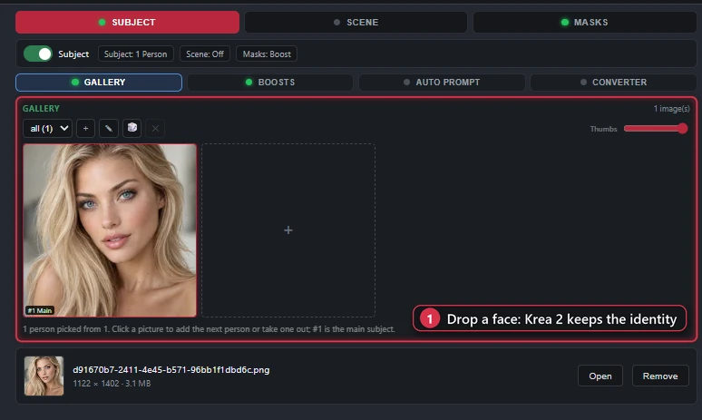
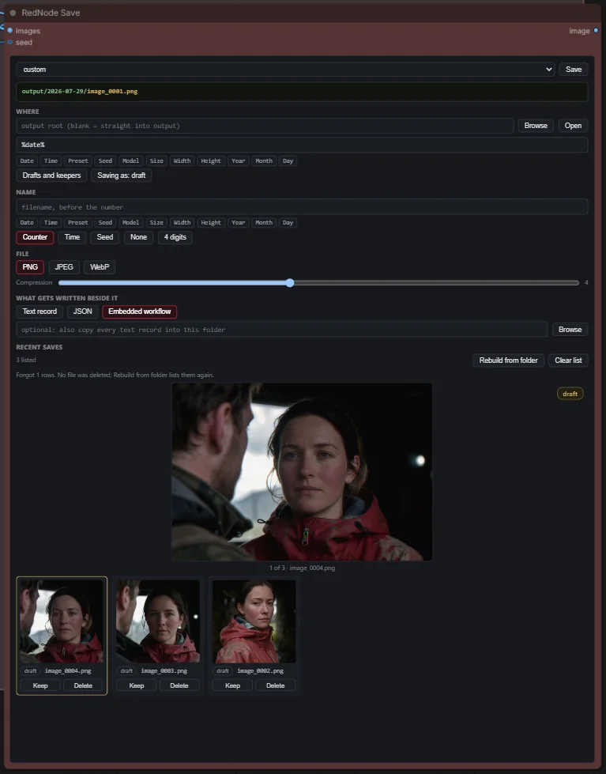

# RedNode Studio

One panel that runs the whole picture, and the nodes around it. The Studio Workspace holds the
models, the prompts, the camera, the LoRAs, the references, the canvas, the painting and the
grading in one tabbed node, samples the render itself, and hands the result to a Detailer that
lists its passes instead of wiring them. Everything else in the pack, the routing, the review,
the saving, the stage comparison, exists to keep the canvas small around that.


**59 nodes · No pip dependencies · Advanced Krea 2 tools included**

- Build and control complex workflows without filling the canvas with utility wires.
- Paint, compare, grade and review images without leaving the workspace panel.
- Run moodboard and identity-preserving Krea 2 workflows from one interface.
- Watch every step of a render as it forms, decoded by the small VAE.

Search **RedNode Studio** in ComfyUI Manager, or clone it:

```
git clone https://github.com/RedNodeAI/ComfyUI-RedNodeStudio.git ComfyUI/custom_nodes/ComfyUI-RedNodeStudio
```

## Install

Search for **RedNode Studio** in ComfyUI Manager, or clone it with the line above.

Restart ComfyUI. Everything registers under the `krea2` and `RedNode` categories in the node menu.

Python 3.10 or newer. No pip dependencies beyond what ComfyUI already installs.

## Quick start

Open the template browser and load **RedNode Studio**, or open
`example_workflows/RedNodeStudio_V1.3.json` directly. It is the whole rig wired up, and it reads
left to right. It pulls in a few other packs, and ComfyUI Manager offers them when you open it.

If you would rather build it yourself, the graph is short:

1. Add **RedNode Studio Workspace**. On its Models tab, make a rig: the model, its CLIP, its VAE,
   and the sampler numbers. Choose **Built-in sampler** and the node renders on its own.
2. Write the prompt on the Prompts tab, and put a reference on the Subject tab if there is a face
   to keep.
3. Wire the workspace's `image` output into **RedNode Studio Detailer**, then into **RedNode Post
   FX**, then into **RedNode Save** and **RedNode Image Review**. Add a **RedNode Live Preview**
   on the same output to watch the render form.

That is one node doing the work and four watching it. The **External sampler** setting is the
other route: the workspace then hands out the model, the conditioning and the latent as sockets,
and your own KSampler does the sampling, which is exactly what every workflow did before the
built-in one existed.

## The Workspace

Fourteen tabs, in four groups. The strip sits on the panel and the panel sits on the node; press
the full screen button and the same panel takes the whole window. The socket tuck, the plug on the
row above the tabs, parks unwired sockets as dots along the node's bottom edge, so a node with
forty sockets is no taller than its panel.


**Models.** A rig is a model with its CLIP and VAE, its sampler numbers, its detailer steps, a
second sampler pair for image to image runs, and which LoRA set it carries. Keep several and switch
the active one; a Detailer pass can name any of them, so a face can be detailed by a different
model from the one that rendered the frame. The same tab chooses between the built-in sampler and
an external one, holds the seed, and can keep two rigs in RAM at once so a two-rig chain stops
reloading. The footer carries the UI scale, the resize long edge, the studio preset and the VRAM
tier, which clamps the expensive dials for a smaller card.

**Prompts.** Rows, each linked to one or more rigs, so a rig renders its own words. A row is either
the Krea 2 frame editor, Subject and Surroundings with the framing dial between them, or a plain
box for any other model. The auto prompt captions the references through a local vision model,
with a length budget, a converter for gender and style swaps, and a saved prompts button.
Wildcards and `@keyword` macros resolve on the run's seed.

**Camera.** The stage from the camera section below, on its own tab, with a master switch. It has
two studios: the one behind the prompt, whose camera writes the paragraph and drives the camera
LoRAs, and a separate one for the Img2Img tab's re-angle.


**LoRAs.** The main stack, plus named sets on their own sub-tabs. Rows drag by their grip, switch
off by their eye, and group under titles; a strength can be a random range with the roll shown
after the run. A rig picks its set by name, and so can a Detailer pass or a paint pass. The Paint
tab has a stack of its own.


**Latent.** The canvas size, with aspect presets, a random size, and an auto latent that follows
the camera's frame at a pixel budget. Refine passes run on the blank canvas: pass 1 generates, and
every pass after it treats what pass 1 made as its source, at a Refine dial or a denoise and a
scale per pass with a Ramp, so a draft-small-then-climb run needs no second node.


**Img2Img.** A source picture, the pass over it, and two stages that run before the pass.
Denoise is a full-width bar, and with several passes each one can have its own denoise and its
own scale. RE-ANGLE re-shoots the source from another viewpoint with the multi-angle edit model,
from three bands or from the Camera tab's studio, and a switch stops after the re-shot so the rig
never enters VRAM beside the edit model. SWAP puts the Subject's face, head or whole person onto
the picture before the pass finishes it.


**Paint.** Mask a region, set the denoise, queue. It composites back by itself, and it runs on
whichever renderer you point it at: a rig from the Models tab, the pack's own Paint Render, or an
outside chain through Paint Out and Paint In. Auto-mask the subject or the background rather than
painting by hand, paint in colour to steer the fill, and run the low-denoise chain as passes in
one Generate. While it samples, the picture forms over the result pane, step by step, at a frame
size the tab chooses. Every result stays in a history, and one click sends the keeper through the
post chain and into the save tree.



**Moodboard, Subject, People, Scene.** Galleries per role, with the fidelity and identity dials
under them and captioning built in. Subject is the face to keep; People are the extra subjects;
Scene is a place rebuilt as in-context latents; Moodboard batches several pictures into one style
signal. Right-click a picture for the gallery menu.

**Masks.** The subject boost mask, which rides into the identity edit and is sized against the
Subject picture, and the edit mask that confines the pass.


**Post.** The grading chain, fifteen effects in physical camera order, with looks you can save and
random ranges on any dial. Depth of field and haze make their own depth map; the Depth card picks
the estimator, the checkpoint and the resolution. RedNode Post Process finds these settings by
itself when it sits at the end of the graph.


**Advanced.** The workspace's preferences for this install rather than this workflow: the paint
layout, the mask overlay, whether prompts echo to the console, and a button to unload the caption
models.

## The Detailer


RedNode Studio Detailer is the post-render work as a list, read top to bottom, with no wires
between the passes. Each pass is a card: what it is, which rig runs it, what it aims at, and three
boxes under that. Sampling holds steps, CFG, sampler, scheduler and a start and end step window,
where anything left empty inherits the rig's own numbers. Strength holds Scale and Denoise as bars
and the Repeat count, and a repeat above one offers a denoise and a scale per round with a Ramp.
Prompt holds the LoRA stack switch and its set, the four Krea 2 references, a LoRA for this pass
only, which Prompts-tab row it reads, and a box that wins over all of that when it has words.

Three kinds of pass:

- **Sampler**: the whole frame refined at a denoise, an image to image over what arrived. Its
  scale sticks, so 0.5 then 2.0 across two passes is the shrink-and-regrow chain.
- **Detailer**: SAM3 segments a target, face, hair, hands, eyes, clothes or background, the crop
  renders at a working resolution, and goes back under a feathered mask. The SAM file and its
  precision are picked once on the node.
- **Upscale**: SeedVR2 at a size, 720p, 1080p, 2K, 1440p or 4K as a pixel budget, with the short
  edge worked out from the frame's own aspect. The loader dials sit on the card.

Duplicate a pass with the button beside its delete and nudge one number, which is how a chain
gets built. Group titles fold and switch a set of passes at once. Premade layouts ship, the face
identity chain among them, and your own save by name. Taps record the input, every pass and the
output into a Stage View strip, so a chain can be read step by step.

## Watching a render


**RedNode Live Preview** shows the picture forming. Wire an image output into it and every step of
that node's render lands on it, decoded by the small VAE, with a bar and the pass it belongs to,
then the finished frame. Both the workspace's built-in sampler and the Detailer's passes stream,
whatever ComfyUI's own preview setting is. For Krea 2 the sharp version needs
`lighttaew2_1.safetensors` in `models/vae_approx`; without it the frames are the colour smear.

**RedNode Image Review** is a preview that remembers: the newest picture on top and the runs before
it in a strip, right-click for Copy, Keep, Name and Rerun with the same seed or fresh ones. Double
click the picture for a full screen room where the wheel zooms and a drag pans. A run that made
several pictures, a camera path or a batch, shows them in a column beside the big one.




**RedNode Save** files by date, preset, seed, model or size, splits drafts from keepers, and keeps
a browser to cull a session without leaving the graph. The Review and the Save node share the
run's id, so keeping the picture you are looking at needs no wire.


**RedNode Stage Tap and Stage View** photograph any point in the graph and compare two of them with
a wipe. The Detailer's Taps feed the same strip.

## Keeping the canvas small


Stages live in subgraphs and groups, so the canvas stays this small however much is in it. Group
Control switches groups on and off from one panel, Group Modes names whole configurations, and
branches you did not pick never execute.


Control Panel drives other nodes' dropdowns, sliders and toggles from one node, including nodes
inside subgraphs. Palette and Router route the graph by colour. Sender and Grabber replace a
canvas of Get and Set nodes with named channels. The wires that are not there are the point.

## The camera stage


RedNode Camera Studio is a stage seen from above. Put the subjects on it, drag the walls out to the
size of the room, then move the camera. Every subject card carries a lock, a duplicate button and a
remove button; a duplicate lands at the end of the list beside its original, unlocked, ready to drag
into place. What comes out of it is not "wide shot": it is the physical
camera language the model already answers to, a lens length, a height, a distance and an angle,
worked out from where you actually put things. The tab has its own switch like the others, so the
whole camera leaves the prompt in one click when you want the words to do the framing instead.

Fifteen setups ship with it, and a set carries the whole stage at once: camera, subjects, room size,
path and lights. Load one and adjust, rather than building a room from nothing every time. A camera
path renders one image per shot, so an orbit from -60 to +60 is a single queue and one scene from
six viewpoints. That holds on the built-in sampler and on an engine rig; an external sampler gets
one conditioning, and the tab says so when a path meets one.


Lights sit on the same stage, each with a size and a distance, and both of those do work.
Illuminance falls off with the square of the distance, and how hard a shadow reads is really the
light's angular size from where the subject is standing, so a wide source close in and a small one
across the room come out as different words. Those words describe light and never fixtures: name a
lamp in a prompt and you get a lamp in the picture, so the wording stays on what the light is doing
to the scene. Exposure runs in stops either side of a centred zero, darker one way and brighter the
other, and colour runs in mireds either side of neutral daylight, warm one way and cool the other.

RedNode Camera LoRAs turns that same geometry into slider strengths. Four camera sliders, zoom,
height, orbit and back, each one off, auto or manual. On auto the slider follows the stage, so
pushing the camera in moves zoom with it and there is no second number to keep in sync. The two
lighting sliders work the same way off the exposure and colour dials. Every slot is empty until you
pick a file, and the node is happy with none of them.

Three of the sliders are mine, trained for Krea 2, and they are attached to the
[v1.2.0 release](https://github.com/RedNodeAI/ComfyUI-RedNodeStudio/releases/tag/v1.2.0):
`camera_height_krea2_rednode`, `camera_orbit_krea2_rednode` and `camera_back_krea2_rednode`. Free to
use and share, just not to sell. The zoom slider and the colour temperature slider are Loraholic's,
on Civitai: [zoom](https://civitai.com/models/2717832) and
[colour temperature](https://civitai.com/models/2760910). The brightness slider is PornMaster Krea2
Light Slider, also on Civitai. They all go in `models/loras`.

## The prompt frame


Word order sets the framing. Open a prompt with the person and you get a close shot. Put the room
first and the camera pulls back, same words. That is most of what "wide" and "close" actually mean
to the model, and it is the first thing to go once a prompt is long enough to be useful.

RedNode Prompt Frame splits the writing into Subject and Surroundings and puts a framing dial
between them. Portrait, Half body, Balanced, Full scene, Roomscale. The two tight steps lead with
the subject and open it with "A close view of" or "A three-quarter view of". Balanced and wider lead
with the surroundings and set the subject inside them, then add a scale cue at the two widest steps,
"seen full length" and "small in the distance". Your wording is never rewritten. Only the order and
the joining words change.

At Full scene and Roomscale a subject with nowhere to stand can drop out of the picture entirely.
Two dropdowns build a placement, "beside the doorway", or type your own and it overrides both.

Style blocks, twenty lighting setups and a brightness ramp slot in around that text at fixed
positions. The second output is a notice line, and it does real work: it says when the style already
lights its own scene and the lighting dropdown will fight it, when a wide framing has no placement,
when the prompt has run past the 90 to 150 word working range, and when Portrait framing carries
surroundings long enough to pull the camera back on their own. Wildcards and @keywords resolve in
the finished text, seeded, the same as the Prompt Box.

The panel builds its preview by asking the node, so what it shows on the canvas is what renders.
The same editor is what a Krea 2 prompt row on the Workspace's Prompts tab is.

RedNode Describe To Boxes fills those boxes from a picture. It sends the image to a local Ollama
vision model, asks for five labelled sections, and hands back Subject, Surroundings and Light and
colour on separate outputs, with the raw reply on a fourth in case the split came back malformed.
Ollama is the only engine verified so far. The vision model is released from VRAM as soon as the
reply lands, so it does not sit on top of your checkpoint for the rest of the queue.

## The Krea 2 system

The workspace works with any model. This section is about the part that only applies to Krea 2.

Stock ComfyUI runs Krea 2 text-to-image perfectly well. These nodes exist for what the stock nodes
cannot do with reference images.

Stock image-reference encodes (the qwen-edit style nodes) pass references through the encoder as
semantic description only, using QwenImage's template rather than Krea 2's. The model learns what
is in your reference, with no control over which aspect transfers, no strength dial, and
multi-reference inputs that can collapse into grid or collage outputs. Core's `ReferenceLatent`
attaches latents that Krea 2's stock model ignores, because there is no in-context pixel path, so
no true identity preservation and no edit-LoRA support.

This pack adds both halves on top of the stock implementation: the moodboard controls (strength,
style against subject extraction, crops, indirect mode, grid-safe packed spans) and the full
identity-edit recipe (in-context source latents at RoPE frames 1 to N, Krea 2 template grounded
instruction and grounded negative, v1.2 fit geometry, ref_boost). Every patch is additive. Leave
the nodes unused and each patched path is bit-identical to stock ComfyUI.

To use it you need:

- ComfyUI with native Krea 2 support
- The **qwen3vl_4b** text encoder with vision weights, loaded through CLIPLoader with type `krea2`
- `qwen_image_vae`
- For editing, a krea2_edit LoRA at strength 1.0 through LoraLoaderModelOnly

The Workspace folds the studio in: a Krea 2 rig encodes through the identity system with the tab
images loaded, so the references never need a wire. **RedNode Studio (Krea 2)** is the same encode
as a node of its own, for a classic graph: it replaces the positive `CLIPTextEncode`, takes the
references on sockets, and outputs a matched positive and negative pair.

Companion to the [Forge Neo version](https://github.com/RedNodeAI/forge-neo-krea2-toolkit), same
algorithms and same knobs.

## The nodes

### Studio and workspace

| Node | What it does |
|---|---|
| RedNode Studio Workspace | The whole input rig in one tabbed panel, wired to the studio by a single bundle. The Latent tab runs refine passes on a blank canvas, the Img2Img tab's RE-ANGLE can stop after the re-shot so the rig stays out of VRAM, a rig can name a second sampler pair for image to image runs, and a camera path renders one image per shot on the built-in sampler and on an engine rig. |
| RedNode Studio Detailer | The post-render passes as a visual list: sampler refines and SAM3 face detailers in order, each with its own rig, steps, CFG, sampler, step window and scale ratio, no wires between them. A pass can repeat with a denoise and a scale per round, pick which Prompts-tab row it reads, and a SeedVR2 upscale pass (720p to 4K) sits in the same list; the SAM file and precision are picked on the node. |
| RedNode Studio (Krea 2) | Moodboard and identity edit in one node, with a matched grounded negative. The studio the Workspace folds in, for a classic graph. |
| RedNode Studio Settings (Advanced) | Every dial in plain language, for when a preset is not enough. |

RedNode Studio Preset Save and Preset Load still ship and still work, but the Workspace covers
what they did. Treat them as legacy.

### Routing and control

| Node | What it does |
|---|---|
| RedNode Palette | The colours that drive every Router. Switch a colour, re-route the graph. |
| RedNode Router (advanced switch) | Each branch passes when its colours are on. Losing branches never run. |
| RedNode Router Control | Counts every Router and turns their unique colour combinations into one non-stacking switchboard. |
| RedNode Switch | Pass one of several inputs through, chosen by name. |
| RedNode Pass (colour trigger) | Passes anything through and flips Palette colours as it goes. |
| RedNode Free VRAM | Unloads models at this exact point in the chain, so a second big model can run on a card that cannot hold both. |
| RedNode Control Panel | Many other nodes' dropdowns and toggles on one node, no wires. |
| RedNode Combo Control | The single-row version of the same idea. |
| RedNode Group Control | Turn workflow groups on and off, with saved scenes. |
| RedNode Group Modes | Named modes that enable one set of groups and bypass the rest. |
| RedNode Rig Out / Rig In | Hand a Models-tab rig's prompt, seed and sampler numbers to an outside engine, then bring its picture back into the chain. |

### Camera

| Node | What it does |
|---|---|
| RedNode Camera Studio | A top-view stage: place the subjects, the walls and the lights, move the camera, and the geometry is written as the physical-camera language Krea 2 obeys. Camera paths render one image per shot. |
| RedNode Camera LoRAs | Applies the camera slider LoRAs (zoom, height, orbit, back) from the studio's own geometry, off / auto / manual per slider. |
| RedNode Camera Multi-Angle | Turns the studio's camera into a Qwen-Image-Edit Multiple-Angles prompt, for re-shooting an existing photo from another viewpoint. |

### Images, painting and review

| Node | What it does |
|---|---|
| RedNode Save | Files images by date, preset and seed, and splits drafts from keepers. |
| RedNode Save Video | Files a batch of frames as mp4, webm, gif or animated webp, into the same tree, tokens and drafts or keepers split RedNode Save uses. |
| RedNode Paint Render | Renders only the region you painted, then composites it back. |
| RedNode Paint Out / Paint In | Hand the painted region to any other renderer, then composite the result back. |
| RedNode Refine Crop / Refine Paste | Cut a masked region out for refinement by any sampler, then put it back. |
| RedNode Image Review | A preview that remembers, with a browsable strip of previous runs. Double-click the picture for a full screen view where the wheel zooms and a drag pans. A run that made several pictures shows them in a column beside the big one; click to view any of them. |
| RedNode Live Preview | Shows the picture forming step by step while the node wired into it renders, then the finished frame. The workspace and the Detailer decode every step with the small VAE (lighttaew2_1 in models/vae_approx for Krea 2) and stream it here, whatever ComfyUI's own preview setting is. |
| RedNode Video Review | The same for a sequence: it plays in the node, with sound, and the last few runs stay in the strip. Wire frames to preview them, or the path from RedNode Save Video to play the file that was actually filed. |
| RedNode Stage Tap / Stage View | Photograph any point in the graph, then compare stages with a wipe. |

### LoRAs and sampling

| Node | What it does |
|---|---|
| RedNode LoRA Stack | Multi-LoRA loader with per-slot strength, random ranges, trigger words and presets. |
| RedNode LoRA Stack Save | Saves a stack under a name. Keep it muted unless you are saving. |
| RedNode Sampler Config (auto turbo) | Detects a turbo distill from the loader's filename and outputs matching settings. |

### Prompting

| Node | What it does |
|---|---|
| RedNode Prompt Box | Prompt editor with highlighting, @keyword macros and a seeded wildcard engine. |
| RedNode Prompt Frame | Subject and Surroundings in their own boxes, emitted in the order that sets the framing. Five steps from Portrait to Roomscale, plus placement, style, lighting and a warnings output. |
| RedNode Describe To Boxes | Reads a picture into Subject, Surroundings and Light and colour, ready to wire into the Frame. Runs on a local Ollama vision model. |
| RedNode Prompt Combine | Prompt pieces joined in the order you drag them, typed, wired, or pulled wholesale from a channel. |
| RedNode Text Combine | The plain string joiner: same rows, no prompt flag. |
| RedNode Prompt Converter | Word-boundary gender and style swaps for captions. |
| RedNode Prompt Keywords | The global @keyword library that every Prompt Box reads. |
| RedNode Selector | A dropdown of your own choices, output as a string. |
| RedNode Note | A canvas label with big glowing text, a colour and a font. Unselected it is just the sign, with no title bar and no settings. |
| RedNode Note Panel | Every RedNode Note in the workflow in one list, with its size, font, colour and glow. Drives them live, and can restyle all of them at once. |
| RedNode Report | A sign whose words come from the run: wire a value through it and it reports what went past, in the same styling. Passes the value straight on. |

### Post processing

| Node | What it does |
|---|---|
| RedNode Post Process | The Workspace Post tab's grading chain. Image in, graded image out. |
| RedNode Post FX (standalone) | The same chain with its own panel, for any image, no workspace needed. Depth of field and haze make their own depth map; the Depth card on the panel picks the estimator, the Depth Anything V2 checkpoint and the working resolution. |

### Moodboard and identity

| Node | What it does |
|---|---|
| Krea 2 Moodboard | One-node vibe transfer. Prompt and references in, conditioning out. |
| Krea 2 Moodboard Encode (packed) | Same, with every reference packed into one vision span. |
| Krea 2 Identity Edit | In-context identity preservation with the edit LoRA. |
| Krea 2 Moodboard + Identity Fusion | Both of the above fused into a single encode. |
| Krea2 Edit Source Chain | Chains extra reference images for multi-reference editing. |
| Krea 2 Conditioning Rebalance | Per-layer reweighting of the Qwen3-VL conditioning stack. |

### Prototypes

Unfinished, and marked so on the node.

| Node | What it does |
|---|---|
| RedNode Group Rules | Rules between groups, and a panel showing what a queue will run before it runs. |
| RedNode Sender / Grabber | Named channels replacing a canvas of Get and Set nodes. One reader lists everything on a channel. They work anywhere, subgraph or not. |
| RedNode Channel Convert | Converts between string, int, float and boolean. Placed automatically when a channel row asks for it. |

## Example workflows

In `example_workflows/`, and in ComfyUI's own template browser once the pack is installed.

- `RedNodeStudio_V1.3.json` is the full rig and the one to start with: a single
  workspace panel drives the models, the prompts and the sampler, with painting, identity
  edit, the Detailer's passes and its SeedVR2 upscale, and the grading chain around it. The rigs
  and the Prompts tab are options rather than requirements, so a graph wired the old way keeps
  working. It pulls in a few other packs and ComfyUI Manager offers them when you open it:
  SeedVR2 Video Upscaler, pysssss custom-scripts, easy-use, comfyui-krea-moodboards and
  Krea2-BBOX-Prompter. Manager installs packs but not models, so the upscaler's two files are
  yours to fetch: `seedvr2_ema_7b_fp8_e4m3fn_mixed_block35_fp16.safetensors` and
  `ema_vae_fp16.safetensors`.
- `RedNode_MultiAngle.json` re-shoots an existing photo from another viewpoint:
  the Camera Studio's geometry becomes a Multiple-Angles prompt for Qwen-Image-Edit-2511, and
  Krea 2 finishes the frame.

Two optional packs matter to the STUDIO itself rather than to a workflow. **ComfyUI-Easy-Sam3**
gives the Detailer its face, hair and hands masks (it wants `sam3.pt` in `models/sam3`). Without
it the pack runs fine and a detailer pass says so and passes the picture through untouched, rather
than failing. **ComfyUI-SeedVR2_VideoUpscaler** is what the Detailer's upscale pass runs on, and
an upscale pass without it passes the picture through the same way.

Baked-in settings worth knowing: ModelSamplingAuraFlow shift 1.15 (ComfyUI's stock Krea 2 default,
the node is there as a handle), Euler with the simple scheduler, turbo at 8 steps and CFG 1. With
the v1.2 LoRA, 8 steps gets composition and 12 gets face detail. Generate at 2MP or under.
Matching output aspect to the source is no longer required once `target_latent` is connected,
though staying close still looks best.

## Downloads

Everything the pack needs beyond ComfyUI and the image models themselves, with where each file
goes. ComfyUI Manager installs the packs; the files are yours to fetch.

### Krea 2

| File | Goes in | Where from |
|---|---|---|
| `qwen3vl_4b_fp8_scaled.safetensors` (or the bf16) | `models/text_encoders` | [Comfy-Org/Krea-2](https://huggingface.co/Comfy-Org/Krea-2/tree/main/text_encoders) |
| `qwen_image_vae.safetensors` | `models/vae` | [Comfy-Org/Krea-2](https://huggingface.co/Comfy-Org/Krea-2/tree/main/vae) |
| `krea2_identity_edit_v1_2.safetensors`, the identity edit LoRA | `models/loras` | [conradlocke/krea2-identity-edit](https://huggingface.co/conradlocke/krea2-identity-edit) |

### Camera and light sliders

| File | Goes in | Where from |
|---|---|---|
| `camera_height_krea2_rednode.safetensors` | `models/loras` | [v1.2.0 release](https://github.com/RedNodeAI/ComfyUI-RedNodeStudio/releases/download/v1.2.0/camera_height_krea2_rednode.safetensors) |
| `camera_orbit_krea2_rednode.safetensors` | `models/loras` | [v1.2.0 release](https://github.com/RedNodeAI/ComfyUI-RedNodeStudio/releases/download/v1.2.0/camera_orbit_krea2_rednode.safetensors) |
| `camera_back_krea2_rednode.safetensors` | `models/loras` | [v1.2.0 release](https://github.com/RedNodeAI/ComfyUI-RedNodeStudio/releases/download/v1.2.0/camera_back_krea2_rednode.safetensors) |
| Zoom slider, Loraholic's | `models/loras` | [Civitai](https://civitai.com/models/2717832) |
| Colour temperature slider, Loraholic's | `models/loras` | [Civitai](https://civitai.com/models/2760910) |

The three camera files are mine: free to use and share, not to sell. The two Loraholic sliders
are theirs and are only ever linked. Every slider slot is optional; the Camera LoRAs card is happy
with none of them, and the brightness slot takes whichever light slider you pick.

### The Detailer

| File | Goes in | Where from |
|---|---|---|
| [ComfyUI-Easy-Sam3](https://github.com/yolain/ComfyUI-Easy-Sam3), the pack | Manager | the face, hair and hands masks |
| `sam3.pt` | `models/sam3` | [facebook/sam3](https://huggingface.co/facebook/sam3), gated: request access on the page, then download |
| [ComfyUI-SeedVR2_VideoUpscaler](https://github.com/numz/ComfyUI-SeedVR2_VideoUpscaler), the pack | Manager | the upscale pass |
| `seedvr2_ema_7b_fp8_e4m3fn_mixed_block35_fp16.safetensors` | `models/SEEDVR2` | [AInVFX/SeedVR2_comfyUI](https://huggingface.co/AInVFX/SeedVR2_comfyUI/tree/main) |
| `ema_vae_fp16.safetensors` | `models/SEEDVR2` | [numz/SeedVR2_comfyUI](https://huggingface.co/numz/SeedVR2_comfyUI/blob/main/ema_vae_fp16.safetensors) |

The SeedVR2 loaders also fetch their files on first use when the folder is empty, so the two rows
above are for anyone who would rather place them by hand. The 3B model is smaller and its loader's
default; the 7B is what the example workflow runs.

### Live preview and depth

| File | Goes in | Where from |
|---|---|---|
| `lighttaew2_1.safetensors`, the small VAE for Krea 2 frames | `models/vae_approx` | [lightx2v/Autoencoders](https://huggingface.co/lightx2v/Autoencoders/blob/main/lighttaew2_1.safetensors) |
| [comfyui_controlnet_aux](https://github.com/Fannovel16/comfyui_controlnet_aux), the pack | Manager | the Post FX Depth card's estimators; each fetches its own weights on first use |

Without the small VAE the live frames still stream, as the colour smear rather than a decode.

### Re-angle and swap

The Img2Img tab's RE-ANGLE and the multi-angle workflow run on Qwen-Image-Edit-2511; the SWAP
stage and the Detailer's swap presets run on the BFS files.

| File | Goes in | Where from |
|---|---|---|
| `qwen_image_edit_2511_fp8mixed.safetensors` | `models/diffusion_models` | [Comfy-Org/Qwen-Image-Edit_ComfyUI](https://huggingface.co/Comfy-Org/Qwen-Image-Edit_ComfyUI/tree/main/split_files/diffusion_models) |
| `qwen_2.5_vl_7b_fp8_scaled.safetensors` | `models/text_encoders` | [Comfy-Org/Qwen-Image_ComfyUI](https://huggingface.co/Comfy-Org/Qwen-Image_ComfyUI/tree/main/split_files/text_encoders) |
| `qwen_image_vae.safetensors` | `models/vae` | the same file as the Krea 2 one above |
| `qwen-image-edit-2511-multiple-angles-lora.safetensors` | `models/loras` | [fal/Qwen-Image-Edit-2511-Multiple-Angles-LoRA](https://huggingface.co/fal/Qwen-Image-Edit-2511-Multiple-Angles-LoRA) |
| `Qwen-Image-Edit-2511-Lightning-4steps-V1.0-bf16.safetensors` | `models/loras` | [lightx2v/Qwen-Image-Edit-2511-Lightning](https://huggingface.co/lightx2v/Qwen-Image-Edit-2511-Lightning) |
| `bfs_head_swap_v1.1_krea2.safetensors` and the body swap file | `models/loras` | [Alissonerdx/BFS-Best-Face-Swap](https://huggingface.co/Alissonerdx/BFS-Best-Face-Swap/tree/main) |

## Performance

Measured on a 5090. A classic single KSampler pass runs about 17 seconds. A full chain, meaning a
second pass, a face detailer and a 4K upscale, lands between 45 and 60 seconds depending on how
much fits in VRAM at once. Mid-range cards land at roughly double, so a full quality chain can pass
a minute and a half per image. Krea 2 is a quality-first model rather than a fast one.

For low VRAM: set resize to 1024, keep to one reference where you can, turn the fidelity dials off
or set boost blocks to `all`, leave the captioner unload default on, and use smaller Ollama models.
The Workspace has a VRAM tier button in its footer that clamps the expensive dials for you.

**RedNode Free VRAM** is the other half of that. Put it in the chain before a second big model
loads, and the first one is unloaded at that exact point rather than when the driver runs out of
room. On a card that cannot hold two models at once, that is the difference between a pass running
normally and a pass running an order of magnitude slower while it spills into system memory.

The example workflow ships with three, all switchable from the panel. Two sit in the Low VRAM
Options group, before the face detailer and before the upscale, and are on by default. The third
is on the Z Turbo detailer branch and is off, because that branch only needs it when the detailer
runs a different model from the main pass.

## Settings and stored data

Global preferences live in ComfyUI's own settings dialog, under **RedNode**: whether
captions are remembered between runs and how many, whether Looks store a thumbnail, how
many runs the Review strip keeps, how many saved images the index remembers, and a button
to clear the regenerable caches. Anything that belongs to a single workflow, the grading
chain, the paint strokes, which images are on a tab, stays on its node instead.

What the pack keeps on disk, measured rather than estimated:

| Where | Size | What |
|---|---|---|
| `user/default/rednode-krea2/` | about 456 KB | presets, scenes, the keyword library, the saved index, and roughly 200 KB of regenerable LoRA caches |
| inside a workflow file | about 65 KB on a large graph | each node's own settings, mostly the Workspace's galleries, dials and strokes |
| beside a saved image | a few KB | the text record, and the JSON one if you asked for it |

Clearing the caches never touches a preset, a record or an image. Those are your work;
the caches rebuild themselves.

## License

**PolyForm Noncommercial 1.0.0.** Free for personal use, hobby projects, research, study and
noncommercial organizations. Commercial use needs my permission, so get in touch. Full terms in
[LICENSE](LICENSE).

In plain language: use it, modify it, learn from it, share it, all fine. Selling it or building it
into something you sell is not, unless you have arranged that with me separately.

ComfyUI itself is GPL-3.0 and is a separate work. Releases up to and including v1.4 were published
under GPL-3.0 and stay available under those terms. The license change applies from v2.0 onward.

## How it works

Small additive patches at import time: packed list-spans in Qwen3-VL preprocessing, moodboard
effects inside Krea 2's `encode_token_weights`, and the in-context ref-latents branch on the Krea 2
DiT, following the same `reference_latents` conditioning contract that QwenImage and Flux edit
models use. A patch guard checks each one at startup and reports what it found. With the nodes
unused, every patched path returns exactly what stock ComfyUI returns.

## Credits

[ComfyUI](https://github.com/comfyanonymous/ComfyUI).
[lbouaraba/ComfyUI-Krea2Edit](https://github.com/lbouaraba/comfyui-krea2edit), Apache-2.0, the
identity-edit dual-conditioning recipe this reimplements.
[nova452/ComfyUI-ConditioningKrea2Rebalance](https://github.com/nova452/ComfyUI-ConditioningKrea2Rebalance)
and [huwhitememes/comfyui-krea2-conditioning](https://github.com/huwhitememes/comfyui-krea2-conditioning),
Apache-2.0, the per-layer rebalance mechanic and its RMS-renormalized variant.
[no8d/ComfyUI-NO8D-controls](https://github.com/no8d/ComfyUI-NO8D-controls), MIT, the LoRA-stack
row-list UI that inspired RedNode LoRA Stack, implemented independently here.
[skatardude10/ComfyUI-Optical-Realism](https://github.com/skatardude10/ComfyUI-Optical-Realism),
which I read as a survey of which optical effects were worth having while building the grading
chain. Loraholic for the Krea 2 zoom and colour temperature sliders the Camera LoRAs card drives.
ethanfel and ostris for the Krea 2 vision-conditioning recipes. Krea.ai for Krea 2, under
the Krea Community License.

Not affiliated with Krea.ai.
