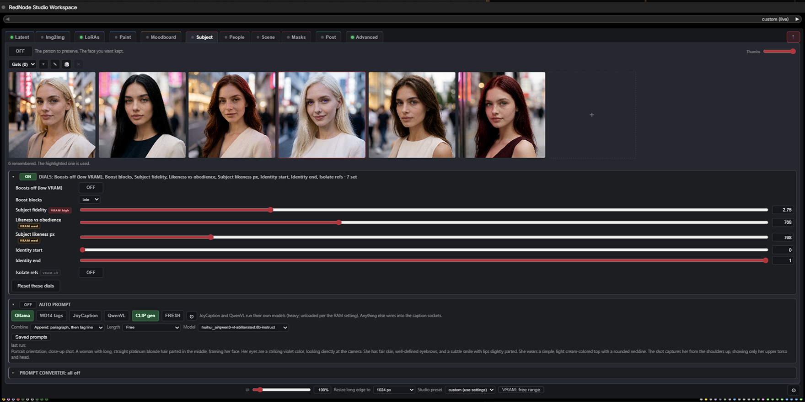
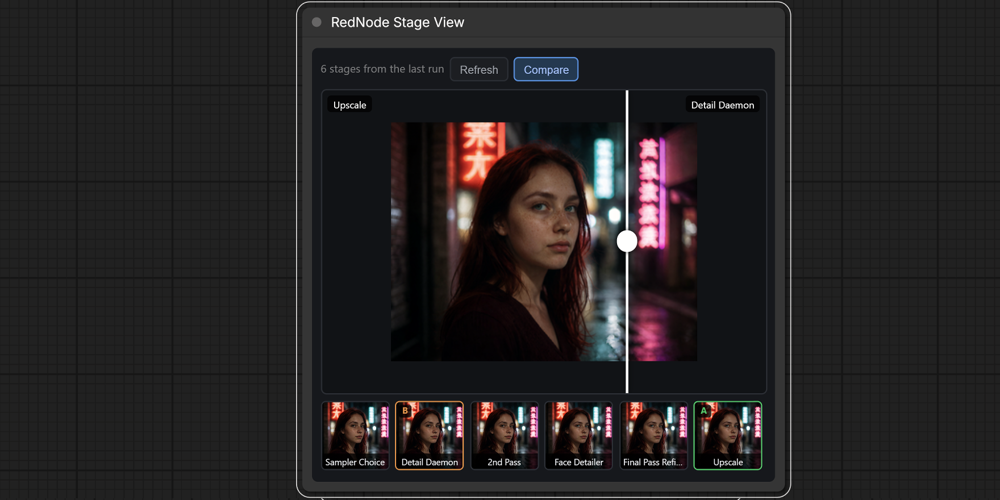
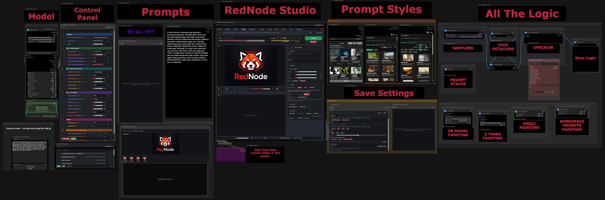
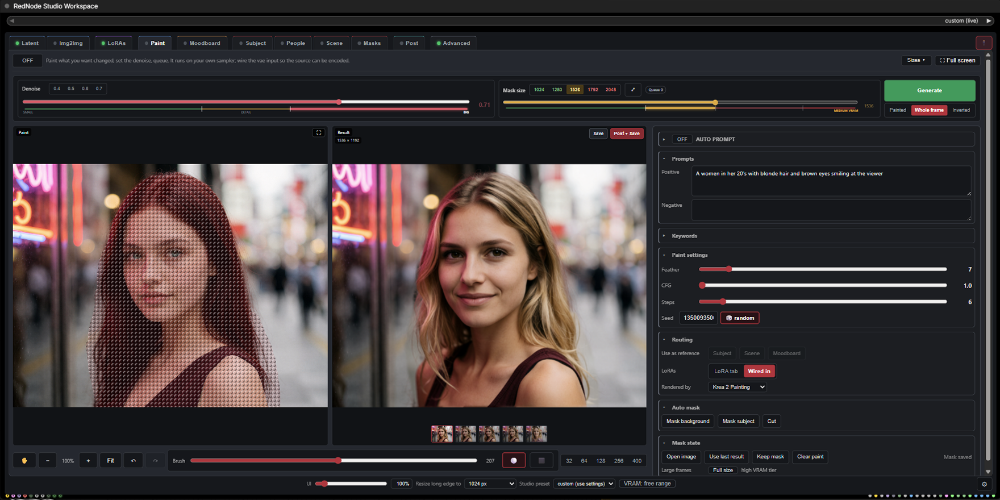
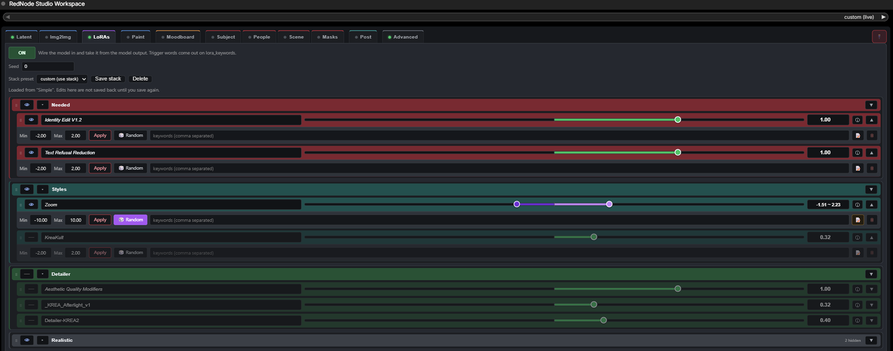
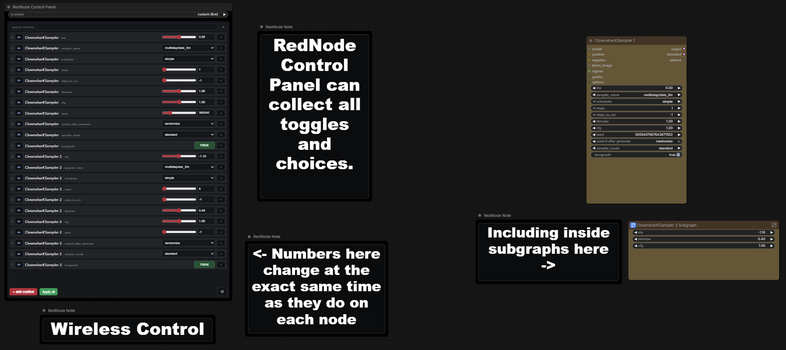
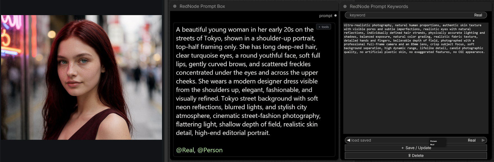
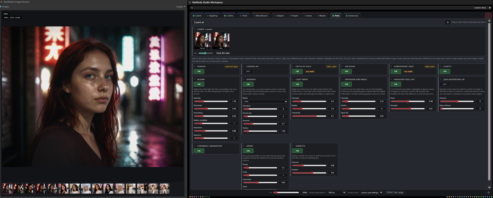
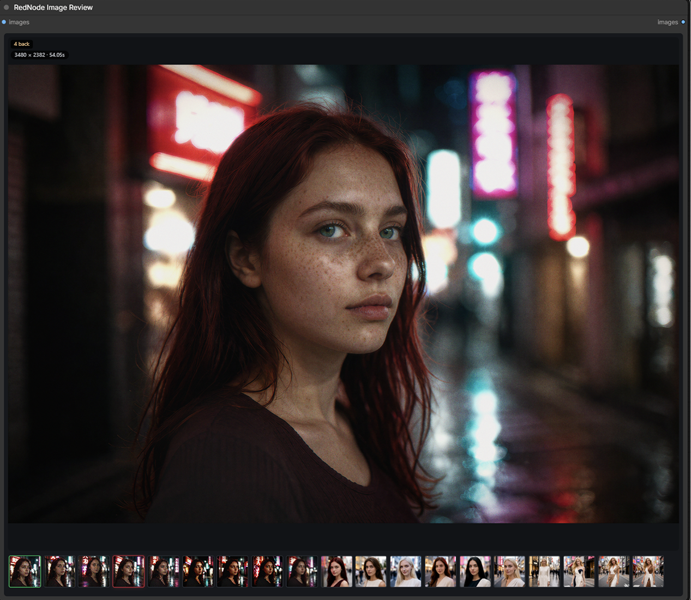

# RedNode Studio

A complete visual workspace and workflow-control rig for ComfyUI: reference management,
painting, wireless controls, LoRA stacking, prompt tools, stage comparison, image review and
post-processing in one pack.



**48 nodes · No pip dependencies · Advanced Krea 2 tools included**

- Build and control complex workflows without filling the canvas with utility wires.
- Paint, compare, grade and review images without leaving the workspace panel.
- Run moodboard and identity-preserving Krea 2 workflows from one interface.

Search **RedNode Studio** in ComfyUI Manager, or clone it:

```
git clone https://github.com/RedNodeAI/ComfyUI-RedNodeStudio.git ComfyUI/custom_nodes/ComfyUI-RedNodeStudio
```

Then open **[Rednode Ultima](example_workflows/Rednode_Ultima_V1.0.2%20Release.json)** in ComfyUI's
template browser. It is the complete rig, and ComfyUI Manager offers its additional node
dependencies when you load it.

## What it looks like



**Compare any two points in the graph with a wipe.** Tap a stage anywhere, then drag to see what
changed. No second window, no exporting to compare.



**A whole pipeline stays readable.** Groups switch on and off from one panel, and branches you did
not pick never execute.



**Paint in the panel.** Mask a region, render only that region, composite it back. Hand it to any
sampler you like.



**LoRA management in one node.** Per-slot strength, random ranges, trigger words and saved presets.



**Wireless controls.** Drive other nodes' dropdowns and toggles from one panel. The wires that
would be there are the point.



**Prompt tooling.** Highlighting, `@keyword` macros from a shared library, and a seeded wildcard
engine.



**Grade without leaving the graph.** The full chain on any image, with or without the workspace.



**A preview that remembers.** Browse previous runs instead of losing them to the next queue.

## Install

Search for **RedNode Studio** in ComfyUI Manager, or clone it:

```
git clone https://github.com/RedNodeAI/ComfyUI-RedNodeStudio.git ComfyUI/custom_nodes/ComfyUI-RedNodeStudio
```

Restart ComfyUI. Everything registers under the `krea2` and `RedNode` categories in the node menu.

Python 3.10 or newer. No pip dependencies beyond what ComfyUI already installs.

## Quick start

Open the template browser and load **Rednode Ultima**, or open
`example_workflows/Rednode_Ultima_V1.0.2 Release.json` directly. It is the whole rig wired up, and
it reads left to right. It pulls in a few other packs, and ComfyUI Manager offers them when you
open it.

If you would rather build it yourself, the short version is:

1. Add **RedNode Studio (Krea 2)**. It replaces your positive `CLIPTextEncode` and outputs a
   matched positive and negative pair.
2. Wire `clip` in, put your instruction in the prompt box, pick a preset.
3. Feed `subject_image` with the face you want kept, and `moodboard_style` with whatever should
   set the look.
4. Connect `output_latent` to your sampler's latent input. That gives you the v1.2 fit geometry.

Once that runs, add **RedNode Studio Workspace** and wire its `workspace` output into the studio's
`workspace` input. The workspace takes over as the front end: image galleries, masks, dials,
captioning, painting and grading, all in one panel.

## The Krea 2 system

The workspace works with any model. This section is about the part that only applies to Krea 2.

Stock ComfyUI runs Krea 2 text-to-image perfectly well. These nodes exist for what the stock nodes
cannot do with reference images.

Stock image-reference encodes (the qwen-edit style nodes) pass references through the encoder as
semantic description only, using QwenImage's template rather than Krea 2's. The model learns what
is in your reference, with no control over which aspect transfers, no strength dial, and
multi-reference inputs that can collapse into grid or collage outputs. Core's `ReferenceLatent`
attaches latents that Krea 2's stock model ignores, because there is no in-context pixel path, so
no true identity preservation and no edit-LoRA support.

This pack adds both halves on top of the stock implementation: the moodboard controls (strength,
style against subject extraction, crops, indirect mode, grid-safe packed spans) and the full
identity-edit recipe (in-context source latents at RoPE frames 1 to N, Krea 2 template grounded
instruction and grounded negative, v1.2 fit geometry, ref_boost). Every patch is additive. Leave
the nodes unused and each patched path is bit-identical to stock ComfyUI.

To use it you need:

- ComfyUI with native Krea 2 support
- The **qwen3vl_4b** text encoder with vision weights, loaded through CLIPLoader with type `krea2`
- `qwen_image_vae`
- For editing, a krea2_edit LoRA at strength 1.0 through LoraLoaderModelOnly

Companion to the [Forge Neo version](https://github.com/RedNodeAI/forge-neo-krea2-toolkit), same
algorithms and same knobs.

## The nodes

Every node carries its own description and tooltips inside ComfyUI, so hover anything you
are unsure about.

### Studio and workspace

| Node | What it does |
|---|---|
| RedNode Studio (Krea 2) | Moodboard and identity edit in one node, with a matched grounded negative. Start here. |
| RedNode Studio Workspace | The whole input rig in one tabbed panel, wired to the studio by a single bundle. |
| RedNode Studio Settings (Advanced) | Every dial in plain language, for when a preset is not enough. |

RedNode Studio Preset Save and Preset Load still ship and still work, but the Workspace covers
what they did. Treat them as legacy.

### Routing and control

| Node | What it does |
|---|---|
| RedNode Palette | The colours that drive every Router. Switch a colour, re-route the graph. |
| RedNode Router (advanced switch) | Each branch passes when its colours are on. Losing branches never run. |
| RedNode Router Control | Counts every Router and turns their unique colour combinations into one non-stacking switchboard. |
| RedNode Switch | Pass one of several inputs through, chosen by name. |
| RedNode Pass (colour trigger) | Passes anything through and flips Palette colours as it goes. |
| RedNode Free VRAM | Unloads models at this exact point in the chain, so a second big model can run on a card that cannot hold both. |
| RedNode Control Panel | Many other nodes' dropdowns and toggles on one node, no wires. |
| RedNode Combo Control | The single-row version of the same idea. |
| RedNode Group Control | Turn workflow groups on and off, with saved scenes. |
| RedNode Group Modes | Named modes that enable one set of groups and bypass the rest. |

### Images, painting and review

| Node | What it does |
|---|---|
| RedNode Save | Files images by date, preset and seed, and splits drafts from keepers. |
| RedNode Paint Render | Renders only the region you painted, then composites it back. |
| RedNode Paint Out / Paint In | Hand the painted region to any other renderer, then composite the result back. |
| RedNode Refine Crop / Refine Paste | Cut a masked region out for refinement by any sampler, then put it back. |
| RedNode Image Review | A preview that remembers, with a browsable strip of previous runs. |
| RedNode Stage Tap / Stage View | Photograph any point in the graph, then compare stages with a wipe. |

### LoRAs and sampling

| Node | What it does |
|---|---|
| RedNode LoRA Stack | Multi-LoRA loader with per-slot strength, random ranges, trigger words and presets. |
| RedNode LoRA Stack Save | Saves a stack under a name. Keep it muted unless you are saving. |
| RedNode Sampler Config (auto turbo) | Detects a turbo distill from the loader's filename and outputs matching settings. |

### Prompting

| Node | What it does |
|---|---|
| RedNode Prompt Box | Prompt editor with highlighting, @keyword macros and a seeded wildcard engine. |
| RedNode Prompt Combine | Prompt pieces joined in the order you drag them, typed, wired, or pulled wholesale from a channel. |
| RedNode Text Combine | The plain string joiner: same rows, no prompt flag. |
| RedNode Prompt Converter | Word-boundary gender and style swaps for captions. |
| RedNode Prompt Keywords | The global @keyword library that every Prompt Box reads. |
| RedNode Selector | A dropdown of your own choices, output as a string. |
| RedNode Note | A canvas label with big glowing text, a colour and a font. Unselected it is just the sign, with no title bar and no settings. |
| RedNode Note Panel | Every RedNode Note in the workflow in one list, with its size, font, colour and glow. Drives them live, and can restyle all of them at once. |
| RedNode Report | A sign whose words come from the run: wire a value through it and it reports what went past, in the same styling. Passes the value straight on. |

### Post processing

| Node | What it does |
|---|---|
| RedNode Post Process | The Workspace Post tab's grading chain. Image in, graded image out. |
| RedNode Post FX (standalone) | The same chain with its own panel, for any image, no workspace needed. |

### Moodboard and identity

| Node | What it does |
|---|---|
| Krea 2 Moodboard | One-node vibe transfer. Prompt and references in, conditioning out. |
| Krea 2 Moodboard Encode (packed) | Same, with every reference packed into one vision span. |
| Krea 2 Identity Edit | In-context identity preservation with the edit LoRA. |
| Krea 2 Moodboard + Identity Fusion | Both of the above fused into a single encode. |
| Krea2 Edit Source Chain | Chains extra reference images for multi-reference editing. |
| Krea 2 Conditioning Rebalance | Per-layer reweighting of the Qwen3-VL conditioning stack. |

### Prototypes

Unfinished, and marked so on the node.

| Node | What it does |
|---|---|
| RedNode Group Rules | Rules between groups, and a panel showing what a queue will run before it runs. |
| RedNode Sender / Grabber | Named channels replacing a canvas of Get and Set nodes. One reader lists everything on a channel. They work anywhere, subgraph or not. |
| RedNode Channel Convert | Converts between string, int, float and boolean. Placed automatically when a channel row asks for it. |

## Example workflows

In `example_workflows/`, and in ComfyUI's own template browser once the pack is installed.

- `Rednode_Ultima_V1.0.2 Release.json`, my daily-driver pipeline with the whole rig wired up:
  workspace panel, painting, identity edit, face detailer, upscale and grading. It pulls in a few
  other packs, and ComfyUI Manager offers them when you open it.

Baked-in settings worth knowing: ModelSamplingAuraFlow shift 1.15 (ComfyUI's stock Krea 2 default,
the node is there as a handle), Euler with the simple scheduler, turbo at 8 steps and CFG 1. With
the v1.2 LoRA, 8 steps gets composition and 12 gets face detail. Generate at 2MP or under.
Matching output aspect to the source is no longer required once `target_latent` is connected,
though staying close still looks best.

## Performance

Measured on a 5090. A classic single KSampler pass runs about 17 seconds. A full chain, meaning a
second pass, a face detailer and a 4K upscale, lands between 45 and 60 seconds depending on how
much fits in VRAM at once. Mid-range cards land at roughly double, so a full quality chain can pass
a minute and a half per image. Krea 2 is a quality-first model rather than a fast one.

For low VRAM: set resize to 1024, keep to one reference where you can, turn the fidelity dials off
or set boost blocks to `all`, leave the captioner unload default on, and use smaller Ollama models.
The Workspace has a VRAM tier button in its footer that clamps the expensive dials for you.

**RedNode Free VRAM** is the other half of that. Put it in the chain before a second big model
loads, and the first one is unloaded at that exact point rather than when the driver runs out of
room. On a card that cannot hold two models at once, that is the difference between a pass running
normally and a pass running an order of magnitude slower while it spills into system memory.

The example workflow ships with three, all switchable from the panel. Two sit in the Low VRAM
Options group, before the face detailer and before the upscale, and are on by default. The third
is on the Z Turbo detailer branch and is off, because that branch only needs it when the detailer
runs a different model from the main pass.

## Settings and stored data

Global preferences live in ComfyUI's own settings dialog, under **RedNode**: whether
captions are remembered between runs and how many, whether Looks store a thumbnail, how
many runs the Review strip keeps, how many saved images the index remembers, and a button
to clear the regenerable caches. Anything that belongs to a single workflow, the grading
chain, the paint strokes, which images are on a tab, stays on its node instead.

What the pack keeps on disk, measured rather than estimated:

| Where | Size | What |
|---|---|---|
| `user/default/rednode-krea2/` | about 456 KB | presets, scenes, the keyword library, the saved index, and roughly 200 KB of regenerable LoRA caches |
| inside a workflow file | about 65 KB on a large graph | each node's own settings, mostly the Workspace's galleries, dials and strokes |
| beside a saved image | a few KB | the text record, and the JSON one if you asked for it |

Clearing the caches never touches a preset, a record or an image. Those are your work;
the caches rebuild themselves.

## License

**PolyForm Noncommercial 1.0.0.** Free for personal use, hobby projects, research, study and
noncommercial organizations. Commercial use needs my permission, so get in touch. Full terms in
[LICENSE](LICENSE).

In plain language: use it, modify it, learn from it, share it, all fine. Selling it or building it
into something you sell is not, unless you have arranged that with me separately.

ComfyUI itself is GPL-3.0 and is a separate work. Releases up to and including v1.4 were published
under GPL-3.0 and stay available under those terms. The license change applies from v2.0 onward.

## How it works

Small additive patches at import time: packed list-spans in Qwen3-VL preprocessing, moodboard
effects inside Krea 2's `encode_token_weights`, and the in-context ref-latents branch on the Krea 2
DiT, following the same `reference_latents` conditioning contract that QwenImage and Flux edit
models use. A patch guard checks each one at startup and reports what it found. With the nodes
unused, every patched path returns exactly what stock ComfyUI returns.

## Credits

[ComfyUI](https://github.com/comfyanonymous/ComfyUI).
[lbouaraba/ComfyUI-Krea2Edit](https://github.com/lbouaraba/comfyui-krea2edit), Apache-2.0, the
identity-edit dual-conditioning recipe this reimplements.
[nova452/ComfyUI-ConditioningKrea2Rebalance](https://github.com/nova452/ComfyUI-ConditioningKrea2Rebalance)
and [huwhitememes/comfyui-krea2-conditioning](https://github.com/huwhitememes/comfyui-krea2-conditioning),
Apache-2.0, the per-layer rebalance mechanic and its RMS-renormalized variant.
[no8d/ComfyUI-NO8D-controls](https://github.com/no8d/ComfyUI-NO8D-controls), MIT, the LoRA-stack
row-list UI that inspired RedNode LoRA Stack, implemented independently here.
[skatardude10/ComfyUI-Optical-Realism](https://github.com/skatardude10/ComfyUI-Optical-Realism),
which I read as a survey of which optical effects were worth having while building the grading
chain. ethanfel and ostris for the Krea 2 vision-conditioning recipes. Krea.ai for Krea 2, under
the Krea Community License.

Not affiliated with Krea.ai.

On Civitai, with release zips and showcase images:
[civitai.com/models/2794961](https://civitai.com/models/2794961/krea-2-moodboard-identity-edit-comfyui-nodes-forge-neo)
